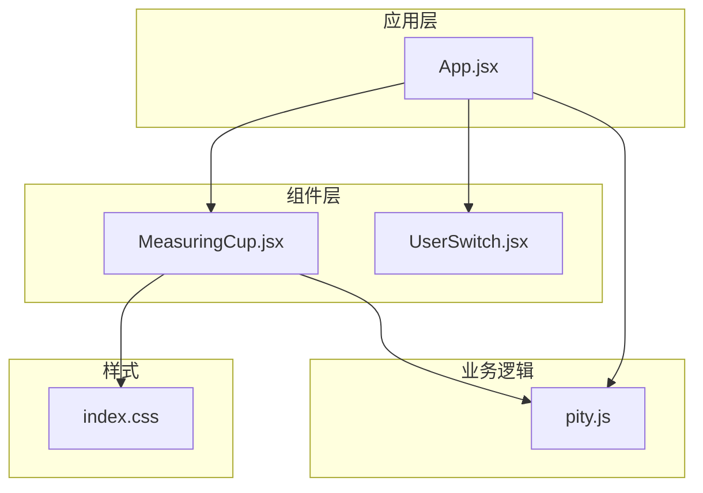
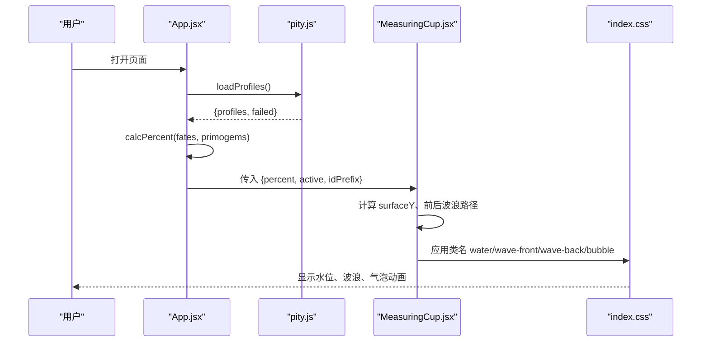
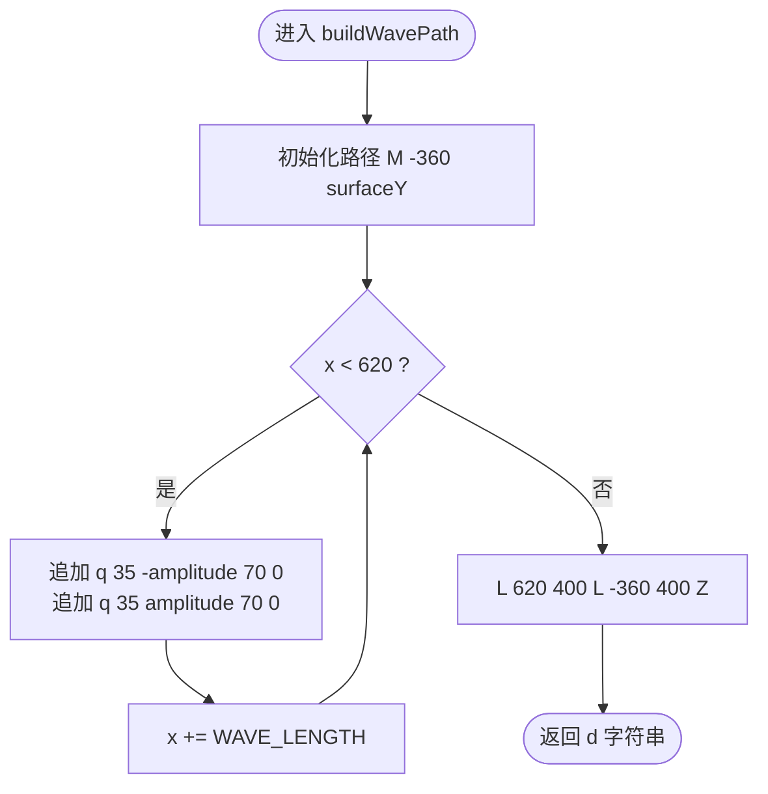
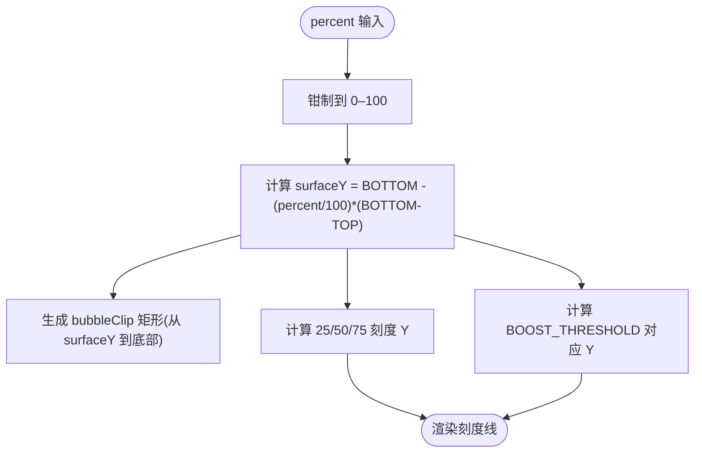
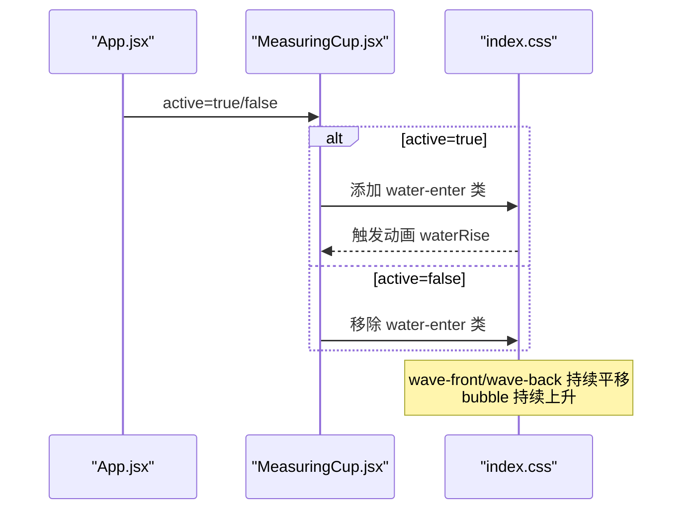
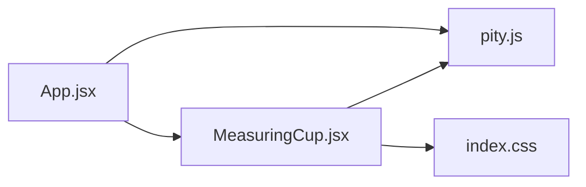

# MeasuringCup组件

<cite>
**本文引用的文件**
- [MeasuringCup.jsx](file://src/components/MeasuringCup.jsx)
- [App.jsx](file://src/App.jsx)
- [pity.js](file://src/lib/pity.js)
- [index.css](file://src/index.css)
- [package.json](file://package.json)
</cite>

## 目录
1. [简介](#简介)
2. [项目结构](#项目结构)
3. [核心组件与职责](#核心组件与职责)
4. [架构总览](#架构总览)
5. [详细组件分析](#详细组件分析)
6. [依赖关系分析](#依赖关系分析)
7. [性能考量](#性能考量)
8. [故障排查指南](#故障排查指南)
9. [结论](#结论)
10. [附录：使用示例与定制](#附录使用示例与定制)

## 简介
MeasuringCup 是一个基于 SVG 的水杯进度条组件，用于可视化“距离保底”的获取进度。它通过波浪路径生成算法、水面高度计算和动态填充效果，呈现前后两层波浪叠加、气泡上升以及激活状态切换等动画。组件支持响应式布局与可访问性（ARIA）标签，并提供多种样式定制点与性能优化建议。

## 项目结构
该仓库采用 React + Vite 的前端工程结构，MeasuringCup 位于 components 目录，业务逻辑与配置解析在 lib 目录，全局样式在 index.css。App 负责加载配置、计算百分比并渲染多个 MeasuringCup。

图表来源
- [App.jsx:1-109](file://src/App.jsx#L1-L109)
- [MeasuringCup.jsx:1-109](file://src/components/MeasuringCup.jsx#L1-L109)
- [pity.js:1-73](file://src/lib/pity.js#L1-L73)
- [index.css:374-709](file://src/index.css#L374-L709)

章节来源
- [package.json:1-20](file://package.json#L1-L20)
- [App.jsx:1-109](file://src/App.jsx#L1-L109)

## 核心组件与职责
- MeasuringCup 组件
  - 接收 props：percent、active、idPrefix
  - 计算水面高度、生成前后波浪路径、绘制刻度线与软保底线
  - 提供 ARIA 语义与可访问性描述
  - 通过 CSS 类名驱动动画（水面上升、波浪平移、气泡上升）
- App 页面
  - 读取配置文件或回退数据，计算每个用户的 percent
  - 控制 active 状态与 idPrefix，将数据传递给 MeasuringCup
- pity.js
  - 定义常量：PITY_COST、FATE_COST、BOOST_THRESHOLD
  - 提供 calcPercent 计算百分比、parseProfiles 解析配置、loadProfiles 拉取配置
- 样式 index.css
  - 定义水杯容器、波浪动画、气泡动画、软保底线高亮、响应式断点与减少动效适配

章节来源
- [MeasuringCup.jsx:17-109](file://src/components/MeasuringCup.jsx#L17-L109)
- [App.jsx:8-109](file://src/App.jsx#L8-L109)
- [pity.js:1-73](file://src/lib/pity.js#L1-L73)
- [index.css:374-709](file://src/index.css#L374-L709)

## 架构总览
MeasuringCup 的数据流从 App 到组件再到样式与动画：

图表来源
- [App.jsx:13-109](file://src/App.jsx#L13-L109)
- [pity.js:22-73](file://src/lib/pity.js#L22-L73)
- [MeasuringCup.jsx:17-109](file://src/components/MeasuringCup.jsx#L17-L109)
- [index.css:395-440](file://src/index.css#L395-L440)

## 详细组件分析

### 组件属性与作用机制
- percent
  - 含义：当前进度百分比（0–100），由 App 通过 calcPercent 计算得出
  - 作用：决定水面高度 surfaceY，影响前后波浪路径的 Y 坐标与裁剪区域
  - 边界处理：组件内部对 percent 进行钳制，确保在 0–100 范围内
- active
  - 含义：是否处于激活态（当前用户面板）
  - 作用：为外层容器添加 is-active 类；为水体组添加 water-enter 类以触发水面上升动画
- idPrefix
  - 含义：唯一前缀，用于生成 defs 中线性渐变与裁剪路径的唯一 ID
  - 作用：避免多实例时 ID 冲突，保证 clipPath 与渐变正确引用

章节来源
- [MeasuringCup.jsx:17-29](file://src/components/MeasuringCup.jsx#L17-L29)
- [App.jsx:68-109](file://src/App.jsx#L68-L109)

### 波浪路径生成算法
- 核心函数 buildWavePath(surfaceY, amplitude)
  - 输入：surfaceY 为水面基准 Y 坐标，amplitude 为波浪振幅
  - 输出：SVG path 的 d 字符串，包含一段重复的正弦样条曲线（q 命令）
  - 实现要点：
    - 起点 M -360 surfaceY，循环 x 步进 WAVE_LENGTH（140）
    - 每段 q 35 -amplitude 70 0 与 q 35 amplitude 70 0 组合形成波峰与波谷
    - 末尾闭合 L 620 400 L -360 400 Z，形成封闭填充区域
- 前后波浪层叠
  - backWave：y 偏移 -3，振幅较小（3），透明度较低，反向动画
  - frontWave：y 为 surfaceY，振幅较大（4.5），正向动画
  - 两者共同营造立体感与流动感

图表来源
- [MeasuringCup.jsx:8-15](file://src/components/MeasuringCup.jsx#L8-L15)

章节来源
- [MeasuringCup.jsx:8-15](file://src/components/MeasuringCup.jsx#L8-L15)
- [MeasuringCup.jsx:28-29](file://src/components/MeasuringCup.jsx#L28-L29)

### 水面高度计算与裁剪
- 水面高度 surfaceY
  - 公式：SURFACE_BOTTOM - (clamped / 100) * (SURFACE_BOTTOM - SURFACE_TOP)
  - 常量：SURFACE_TOP=62，SURFACE_BOTTOM=236，因此水面范围在 62–236 之间
- 裁剪区域 bubbleClip
  - 使用 rect 从 surfaceY 开始向下裁剪，使气泡仅在水面以下可见
- 刻度线 ticks
  - 在 25%、50%、75% 处绘制水平短线，便于视觉定位
- 软保底线 boost-line
  - 根据 BOOST_THRESHOLD 计算阈值 Y，当 clamped >= BOOST_THRESHOLD 时高亮显示

图表来源
- [MeasuringCup.jsx:18-39](file://src/components/MeasuringCup.jsx#L18-L39)
- [pity.js:7-8](file://src/lib/pity.js#L7-L8)

章节来源
- [MeasuringCup.jsx:18-39](file://src/components/MeasuringCup.jsx#L18-L39)
- [pity.js:7-8](file://src/lib/pity.js#L7-L8)

### 动画效果实现
- 水面上升动画 waterRise
  - 当 active 为真时，水体组获得 water-enter 类，触发 scaleY 从 0 到 1 的过渡，配合淡入
- 波浪平移 waveShift
  - frontWave：正向平移 140px 周期循环
  - backWave：反向平移，速度不同，营造视差
- 气泡上升 bubbleRise
  - 三个气泡分别设置不同时长与延迟，沿 Y 轴向上移动并渐隐
- 减少动效适配
  - prefers-reduced-motion 媒体查询下禁用所有动画与过渡，提升可访问性

图表来源
- [MeasuringCup.jsx:41-65](file://src/components/MeasuringCup.jsx#L41-L65)
- [index.css:395-440](file://src/index.css#L395-L440)
- [index.css:686-709](file://src/index.css#L686-L709)

章节来源
- [index.css:395-440](file://src/index.css#L395-L440)
- [index.css:686-709](file://src/index.css#L686-L709)

### 可访问性与语义化结构
- role="img" 与 aria-label
  - SVG 根节点声明 role="img"，并通过 aria-label 提供可读文本，如“五星角色获取进度 X.XX%”
- 装饰元素 aria-hidden
  - 背景、星星、规则线等装饰性元素标记 aria-hidden="true"，避免读屏器冗余播报
- 键盘焦点与可见焦点
  - 切换按钮具备 focus-visible 样式，便于键盘导航识别

章节来源
- [MeasuringCup.jsx:42-42](file://src/components/MeasuringCup.jsx#L42-L42)
- [App.jsx:28-44](file://src/App.jsx#L28-L44)
- [index.css:567-570](file://src/index.css#L567-L570)

### 响应式设计
- 容器宽度
  - svg 宽度使用 min(38vw, 350px)，在小屏下自适应缩放
- 网格布局
  - 使用 CSS Grid 与 clamp 控制间距与字号，适配不同屏幕尺寸
- 断点
  - 820px 与 520px 两处媒体查询调整布局与字体大小，保证移动端可用性

章节来源
- [index.css:389-393](file://src/index.css#L389-L393)
- [index.css:572-684](file://src/index.css#L572-L684)

## 依赖关系分析
- App 依赖 pity.js 的 loadProfiles 与 calcPercent
- MeasuringCup 依赖 pity.js 的 BOOST_THRESHOLD 用于软保底线位置
- MeasuringCup 通过 className 与 index.css 中的动画类名耦合

图表来源
- [App.jsx:1-109](file://src/App.jsx#L1-L109)
- [MeasuringCup.jsx:1-109](file://src/components/MeasuringCup.jsx#L1-L109)
- [pity.js:1-73](file://src/lib/pity.js#L1-L73)
- [index.css:374-709](file://src/index.css#L374-L709)

章节来源
- [App.jsx:1-109](file://src/App.jsx#L1-L109)
- [MeasuringCup.jsx:1-109](file://src/components/MeasuringCup.jsx#L1-L109)
- [pity.js:1-73](file://src/lib/pity.js#L1-L73)
- [index.css:374-709](file://src/index.css#L374-L709)

## 性能考量
- 计算缓存
  - 使用 useMemo 缓存前后波浪路径，避免重复计算
- 动画性能
  - 使用 transform 与 opacity 动画，GPU 加速友好
  - will-change 提示浏览器优化 transform 与 background-position
- 减少动效
  - 通过 prefers-reduced-motion 禁用动画，降低低端设备负担
- 资源与渲染
  - 使用 clipPath 裁剪气泡，减少不必要的重绘
  - 合理设置 stroke-width 与 fill 透明度，避免过度复杂路径

[本节为通用性能指导，不直接分析具体代码行]

## 故障排查指南
- 百分比异常
  - 检查 App 是否正确调用 calcPercent，确认 fates 与 primogems 数值有效
  - 若配置文件读取失败，会回退到 FALLBACK_PROFILES，注意界面提示
- 水位不更新
  - 确认 percent 变化能触发重新渲染；检查钳制逻辑是否导致值不变
- 动画未生效
  - 检查 CSS 类名是否正确应用（water-enter、wave-front、wave-back、bubble）
  - 确认未启用 prefers-reduced-motion 导致动画被禁用
- 软保底线未高亮
  - 检查 clamped 与 BOOST_THRESHOLD 的比较逻辑，确认阈值计算正确

章节来源
- [pity.js:22-73](file://src/lib/pity.js#L22-L73)
- [MeasuringCup.jsx:18-39](file://src/components/MeasuringCup.jsx#L18-L39)
- [index.css:442-450](file://src/index.css#L442-L450)

## 结论
MeasuringCup 通过简洁而高效的 SVG 路径生成与 CSS 动画，实现了直观且美观的水杯进度可视化。其设计兼顾了可访问性、响应式布局与性能优化，适合作为游戏保底进度展示的核心组件。通过合理的 props 设计与样式定制点，开发者可以灵活集成到各类应用中。

[本节为总结性内容，不直接分析具体代码行]

## 附录：使用示例与定制

### 基本用法
- 在 App 中引入并渲染 MeasuringCup，传入 percent、active、idPrefix
- percent 由 calcPercent 计算得到，active 标识当前用户面板，idPrefix 用于唯一 ID 前缀

章节来源
- [App.jsx:68-109](file://src/App.jsx#L68-L109)
- [MeasuringCup.jsx:17-29](file://src/components/MeasuringCup.jsx#L17-L29)

### 样式定制选项
- 颜色与渐变
  - 修改 defs 中的 linearGradient 颜色与透明度，自定义水体与玻璃质感
- 波浪参数
  - 调整 WAVE_LENGTH、amplitude 改变波浪频率与幅度
- 动画时长与缓动
  - 在 index.css 中调整 waveShift、bubbleRise、waterRise 的时长与关键帧
- 软保底线样式
  - 修改 .boost-line 与 .is-reached 的颜色与虚线样式

章节来源
- [MeasuringCup.jsx:43-58](file://src/components/MeasuringCup.jsx#L43-L58)
- [index.css:395-450](file://src/index.css#L395-L450)

### 性能优化建议
- 使用 useMemo 缓存路径计算（已实现）
- 限制同时渲染的 MeasuringCup 数量，避免过多动画叠加
- 在低性能设备上优先使用静态图或简化动画
- 利用 CSS 变量集中管理主题色，便于按需替换

[本节为通用优化建议，不直接分析具体代码行]