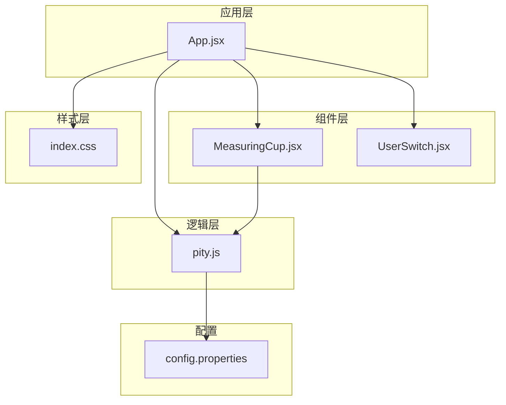
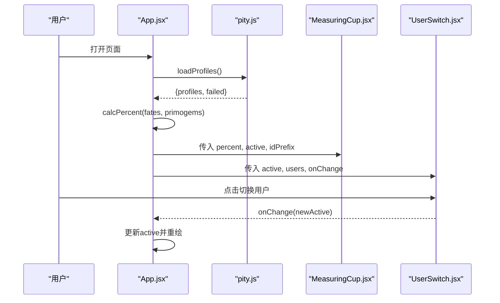
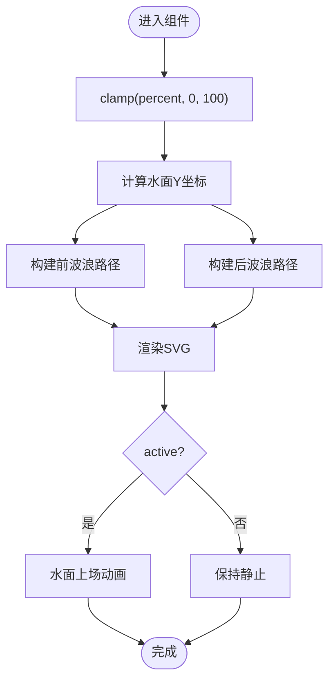
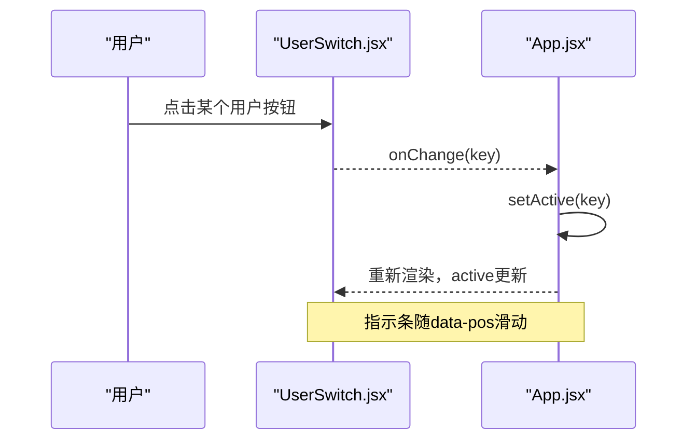
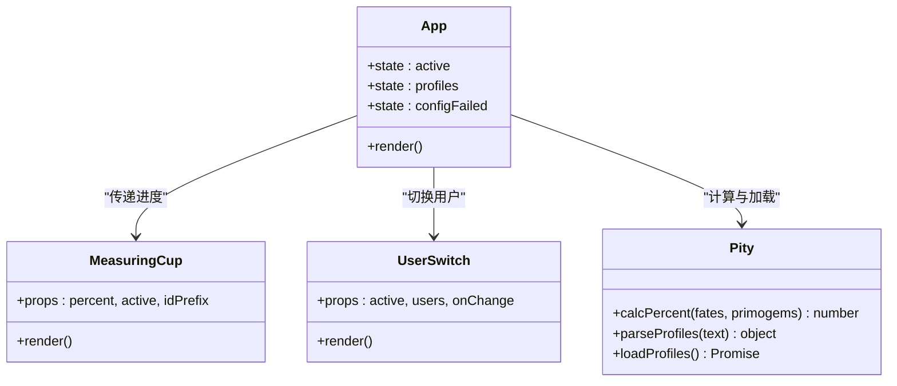
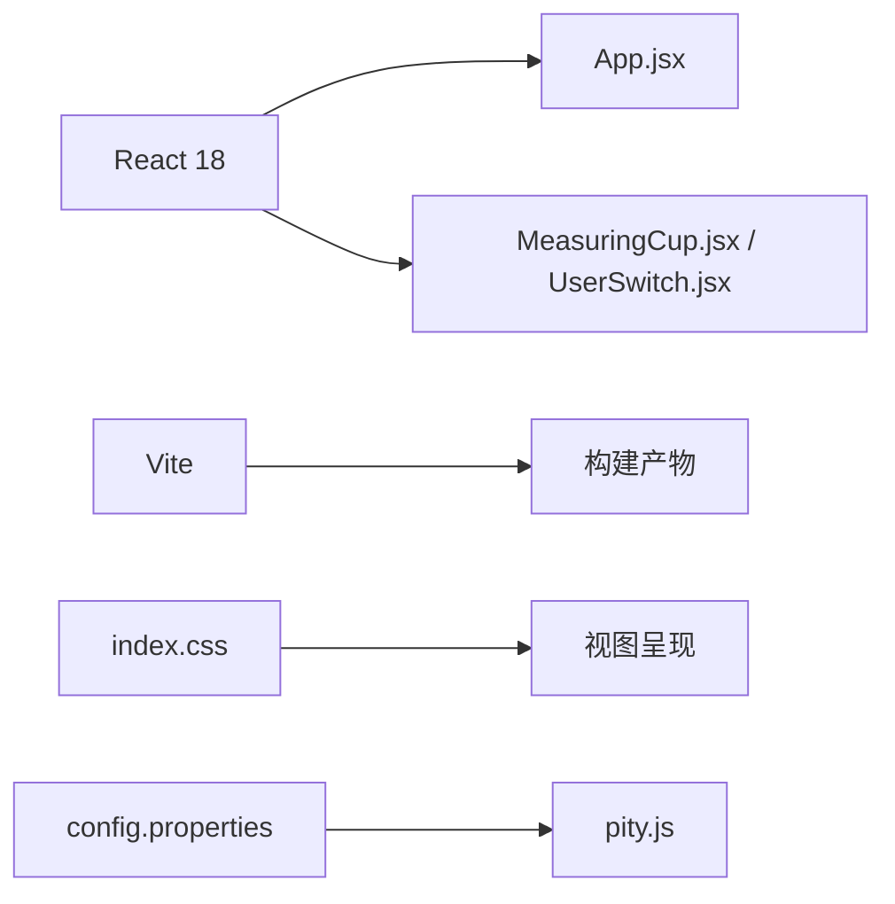

# UI组件

<cite>
**本文引用的文件**
- [MeasuringCup.jsx](file://src/components/MeasuringCup.jsx)
- [UserSwitch.jsx](file://src/components/UserSwitch.jsx)
- [App.jsx](file://src/App.jsx)
- [pity.js](file://src/lib/pity.js)
- [index.css](file://src/index.css)
- [config.properties](file://public/config.properties)
- [package.json](file://package.json)
</cite>

## 目录
1. [简介](#简介)
2. [项目结构](#项目结构)
3. [核心组件](#核心组件)
4. [架构总览](#架构总览)
5. [详细组件分析](#详细组件分析)
6. [依赖关系分析](#依赖关系分析)
7. [性能与可访问性](#性能与可访问性)
8. [故障排查指南](#故障排查指南)
9. [结论](#结论)
10. [附录：使用示例与集成方式](#附录使用示例与集成方式)

## 简介
本仓库实现了一个以“水杯进度条”为核心的UI组件系统，用于可视化展示角色获取保底进度。系统包含两个关键组件：
- MeasuringCup：SVG水杯进度条，具备波浪动画、气泡、软保底阈值线等视觉表现，支持响应式缩放与主题变量。
- UserSwitch：用户切换开关，提供双用户状态切换、键盘与屏幕阅读器友好的交互体验。

应用通过读取配置文件或回退数据计算当前用户的保底百分比，并在页面上联动显示。整体采用React + Vite构建，样式基于CSS变量与媒体查询实现跨设备适配。

## 项目结构
- src/components：UI组件（MeasuringCup、UserSwitch）
- src/lib：业务逻辑（保底计算、配置解析与加载）
- src：入口与页面布局（App、样式、字体）
- public：静态资源与配置文件
- package.json：依赖与脚本

图表来源
- [App.jsx:1-109](file://src/App.jsx#L1-L109)
- [MeasuringCup.jsx:1-109](file://src/components/MeasuringCup.jsx#L1-L109)
- [UserSwitch.jsx:1-22](file://src/components/UserSwitch.jsx#L1-L22)
- [pity.js:1-73](file://src/lib/pity.js#L1-L73)
- [index.css:1-710](file://src/index.css#L1-L710)
- [config.properties:1-21](file://public/config.properties#L1-L21)

章节来源
- [package.json:1-20](file://package.json#L1-L20)

## 核心组件
- MeasuringCup：接收 percent、active、idPrefix 三个属性，渲染SVG水杯，内部根据percent动态计算水面高度，生成前后两层波浪路径，叠加气泡与软保底阈值线；active控制水面上升入场动画。
- UserSwitch：接收 active、users、onChange，渲染左右两个按钮，通过data-pos驱动底部指示条滑动，点击触发onChange更新父级状态。

章节来源
- [MeasuringCup.jsx:17-109](file://src/components/MeasuringCup.jsx#L17-L109)
- [UserSwitch.jsx:3-21](file://src/components/UserSwitch.jsx#L3-L21)

## 架构总览
应用启动后，App负责：
- 异步加载配置并解析为 profiles（失败时回退到内置数据）
- 计算每个用户的保底百分比
- 将数据传递给 MeasuringCup 和 UserSwitch
- 通过 CSS transform 在面板间切换，配合 UserSwitch 的 onChange 更新 active 用户

图表来源
- [App.jsx:13-104](file://src/App.jsx#L13-L104)
- [pity.js:22-73](file://src/lib/pity.js#L22-L73)
- [MeasuringCup.jsx:17-109](file://src/components/MeasuringCup.jsx#L17-L109)
- [UserSwitch.jsx:3-21](file://src/components/UserSwitch.jsx#L3-L21)

## 详细组件分析

### MeasuringCup 组件
- 视觉外观
  - SVG容器，宽度自适应，高度按比例缩放
  - 液体区域由两条波浪路径组成（前波、后波），使用线性渐变填充，营造深度感
  - 气泡元素位于液体区域内，按不同时长与延迟循环上升
  - 软保底阈值线：当 percent >= BOOST_THRESHOLD 时高亮显示
  - 刻度线：固定位置标注25%、50%、75%参考线
- 行为与交互
  - percent 变化时，水面高度随之变化；active 为真时，水面上升入场动画
  - 波浪路径通过数学函数周期性拼接，形成连续波纹
  - 气泡被裁剪到液体区域内，避免溢出
- 响应式适配
  - SVG宽度使用 min(38vw, 350px)，在小屏下自动缩小
  - 媒体查询调整布局与尺寸，保证移动端可读性
- 动画与过渡
  - 水面上场动画：scaleY从0到1，带缓动曲线
  - 波浪平移：前后波以不同周期反向移动，产生流动感
  - 气泡上升：多组不同时长与延迟的循环动画
  - 减少动效模式：prefers-reduced-motion 下禁用所有动画与过渡
- 可访问性
  - SVG设置 role="img" 与 aria-label，描述当前百分比
  - 阈值线与刻度线作为辅助信息，不干扰主要语义
- 性能优化
  - 使用 useMemo 缓存波浪路径，避免重复计算
  - 使用 clipPath 裁剪气泡，减少重绘范围
  - 使用 will-change 提示浏览器对transform进行合成优化

图表来源
- [MeasuringCup.jsx:17-109](file://src/components/MeasuringCup.jsx#L17-L109)
- [index.css:374-450](file://src/index.css#L374-L450)

章节来源
- [MeasuringCup.jsx:1-109](file://src/components/MeasuringCup.jsx#L1-L109)
- [index.css:374-450](file://src/index.css#L374-L450)

### UserSwitch 组件
- 功能概述
  - 提供两个用户选项（userA、userB），当前选中项高亮并带动画指示条
  - 点击按钮触发 onChange，由父组件更新 active 状态
- 状态管理
  - active 表示当前选中的用户键名
  - data-pos 用于驱动底部指示条的位移
- 事件处理
  - onClick 调用 onChange(key)
  - 支持键盘导航与焦点可见性（由样式提供 focus-visible）
- 可访问性
  - 外层容器 role="tablist"，按钮 role="tab"，aria-selected 反映选中状态
  - aria-label 描述控件用途
- 样式与动画
  - 底部指示条通过 transform: translateX 平滑切换
  - 激活态按钮颜色与图标变化
  - 减少动效模式下禁用过渡

图表来源
- [UserSwitch.jsx:3-21](file://src/components/UserSwitch.jsx#L3-L21)
- [App.jsx:8-104](file://src/App.jsx#L8-L104)
- [index.css:497-570](file://src/index.css#L497-L570)

章节来源
- [UserSwitch.jsx:1-22](file://src/components/UserSwitch.jsx#L1-L22)
- [index.css:497-570](file://src/index.css#L497-L570)

### App 与业务逻辑
- 数据流
  - 加载配置：loadProfiles 尝试拉取 config.properties，失败则返回 FALLBACK_PROFILES
  - 解析配置：parseProfiles 仅识别 userA/userB 的 fates、primogems、name
  - 计算进度：calcPercent 将已消耗原石与剩余原石换算为百分比
- 界面联动
  - 通过 ORDER 数组控制面板顺序与偏移量
  - 将 percent 传给 MeasuringCup，将 active/users/onChange 传给 UserSwitch
- 错误处理
  - 网络或解析失败时，显示警告提示并使用兜底数据

图表来源
- [App.jsx:1-109](file://src/App.jsx#L1-L109)
- [MeasuringCup.jsx:17-109](file://src/components/MeasuringCup.jsx#L17-L109)
- [UserSwitch.jsx:3-21](file://src/components/UserSwitch.jsx#L3-L21)
- [pity.js:22-73](file://src/lib/pity.js#L22-L73)

章节来源
- [App.jsx:1-109](file://src/App.jsx#L1-L109)
- [pity.js:1-73](file://src/lib/pity.js#L1-L73)

## 依赖关系分析
- React 18 与 React DOM 提供组件化能力与渲染引擎
- Vite 作为构建工具，支持快速开发与生产构建
- 样式与动画完全基于原生CSS，无第三方UI库依赖
- 配置数据来自外部 properties 文件或内置回退数据

图表来源
- [package.json:11-18](file://package.json#L11-L18)
- [index.css:1-710](file://src/index.css#L1-L710)
- [pity.js:61-73](file://src/lib/pity.js#L61-L73)

章节来源
- [package.json:1-20](file://package.json#L1-L20)

## 性能与可访问性
- 性能
  - 使用 useMemo 缓存波浪路径，降低重复计算开销
  - 使用 clipPath 限制气泡绘制区域，减少重绘
  - 使用 will-change 提示浏览器对 transform 进行合成优化
  - 动画与过渡尽量使用GPU加速属性（transform、opacity）
  - 减少动效模式：prefers-reduced-motion 下禁用所有动画与过渡，提升可访问性与性能
- 可访问性
  - SVG 设置 role="img" 与 aria-label，便于屏幕阅读器理解
  - UserSwitch 使用 tablist/tab 语义与 aria-selected，支持键盘导航
  - 焦点可见性：focus-visible 提供清晰焦点指示
- 跨浏览器兼容
  - 使用标准CSS特性（clip-path、linear-gradient、transform、animation）
  - 媒体查询覆盖主流分辨率断点
  - 字体栈包含常见中文字体回退，确保文本可读性

章节来源
- [MeasuringCup.jsx:1-109](file://src/components/MeasuringCup.jsx#L1-L109)
- [index.css:686-709](file://src/index.css#L686-L709)

## 故障排查指南
- 配置加载失败
  - 现象：页面顶部显示“配置文件读取失败，当前使用内置兜底数据”
  - 原因：fetch 请求失败或返回非200状态码
  - 处理：自动回退到 FALLBACK_PROFILES，不影响基本功能
  - 定位：检查网络与BASE_URL配置，确认 config.properties 可访问
  - 相关代码路径
    - [pity.js:61-73](file://src/lib/pity.js#L61-L73)
    - [App.jsx:13-23](file://src/App.jsx#L13-L23)
- 百分比异常
  - 现象：百分比超过100%或低于0%
  - 原因：输入值未做边界处理
  - 处理：组件内 clamp 限制在0-100之间
  - 相关代码路径
    - [MeasuringCup.jsx:18-19](file://src/components/MeasuringCup.jsx#L18-L19)
- 动画卡顿或闪烁
  - 现象：切换用户或水位变化时出现掉帧
  - 原因：大量DOM操作或复杂滤镜
  - 处理：使用 transform 与 opacity 动画，启用 will-change，减少重排
  - 相关代码路径
    - [index.css:246-255](file://src/index.css#L246-L255)
    - [index.css:395-418](file://src/index.css#L395-L418)
- 移动端显示异常
  - 现象：布局错乱或内容溢出
  - 原因：未适配小屏断点
  - 处理：检查媒体查询与网格布局，确保响应式正确
  - 相关代码路径
    - [index.css:572-684](file://src/index.css#L572-L684)

章节来源
- [pity.js:61-73](file://src/lib/pity.js#L61-L73)
- [MeasuringCup.jsx:18-19](file://src/components/MeasuringCup.jsx#L18-L19)
- [index.css:246-255](file://src/index.css#L246-L255)
- [index.css:395-418](file://src/index.css#L395-L418)
- [index.css:572-684](file://src/index.css#L572-L684)

## 结论
该UI组件系统以简洁的React组件与原生CSS为核心，实现了高可用、高性能的水杯进度条与用户切换功能。通过合理的状态管理、动画设计与可访问性保障，能够在多设备上提供一致的体验。同时，配置驱动的进度计算使系统具备良好的扩展性与维护性。

## 附录：使用示例与集成方式
- 集成步骤
  - 在应用中引入 MeasuringCup 与 UserSwitch
  - 通过 App 管理 active 用户与 profiles 数据
  - 将 percent 计算结果传入 MeasuringCup，将 onChange 绑定到 UserSwitch
  - 样式已在 index.css 中定义，可直接复用
- 组件属性与事件
  - MeasuringCup
    - props: percent（数字，0-100）、active（布尔，是否显示入场动画）、idPrefix（字符串，用于唯一ID前缀）
    - 无自定义插槽与事件
  - UserSwitch
    - props: active（字符串，当前选中用户键）、users（对象，用户数据映射）、onChange（函数，接收新选中键）
    - 无自定义插槽
- 主题与样式定制
  - 通过CSS变量（如 --gold、--blue-soft、--text）统一控制色彩与字体
  - 可通过覆盖 .cup、.switch 等类名进行局部样式调整
  - 支持 prefers-reduced-motion 自动降级动画
- 实时演示
  - 运行开发服务器查看效果
  - 修改 config.properties 中的数值，刷新页面观察进度变化
  - 切换用户按钮验证状态管理与动画效果
- 与其他UI元素的组合
  - 可与标题、说明文本、指标卡片等组合，形成完整的信息面板
  - 通过网格布局与间距控制，确保在不同屏幕下的可读性与美观度

章节来源
- [App.jsx:38-104](file://src/App.jsx#L38-L104)
- [index.css:1-710](file://src/index.css#L1-L710)
- [config.properties:12-21](file://public/config.properties#L12-L21)