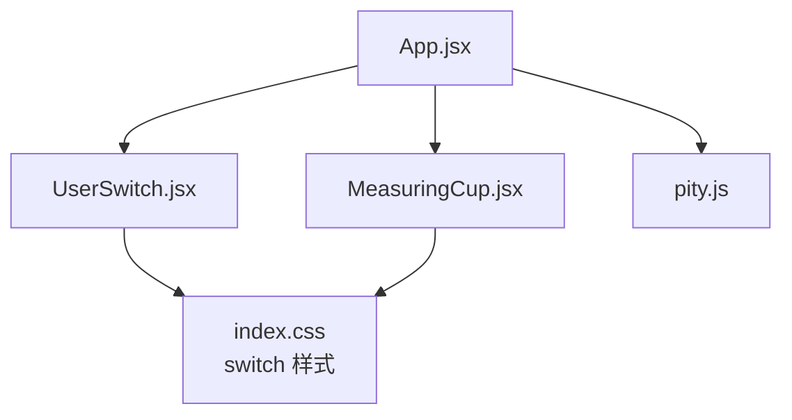
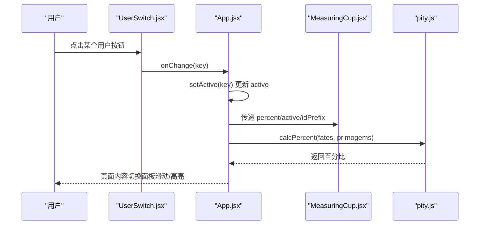
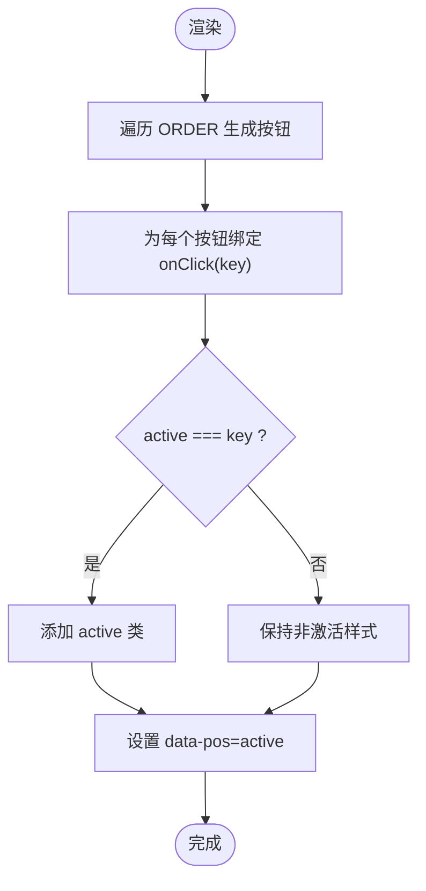
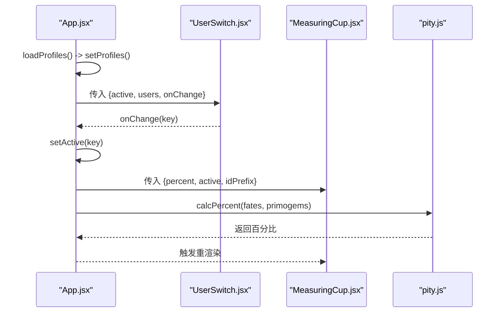
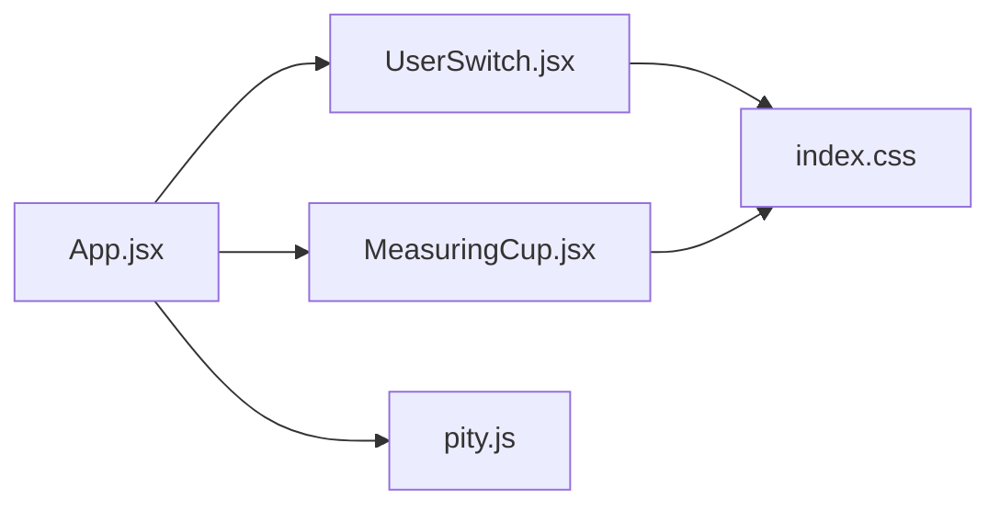

# UserSwitch组件

<cite>
**本文引用的文件**
- [UserSwitch.jsx](file://src/components/UserSwitch.jsx)
- [App.jsx](file://src/App.jsx)
- [index.css](file://src/index.css)
- [pity.js](file://src/lib/pity.js)
- [MeasuringCup.jsx](file://src/components/MeasuringCup.jsx)
</cite>

## 目录
1. [简介](#简介)
2. [项目结构](#项目结构)
3. [核心组件与职责](#核心组件与职责)
4. [架构总览](#架构总览)
5. [详细组件分析](#详细组件分析)
6. [依赖关系分析](#依赖关系分析)
7. [性能考量](#性能考量)
8. [故障排查指南](#故障排查指南)
9. [结论](#结论)
10. [附录：使用示例与集成指南](#附录使用示例与集成指南)

## 简介
UserSwitch 是一个用于在多个用户之间切换的轻量级 React 组件。它通过一组按钮（Tab）展示当前活跃用户，并提供点击切换、视觉反馈与键盘导航支持。该组件采用受控模式，由父组件管理活跃用户标识，并通过回调通知状态变更，从而驱动整个页面的数据与视图同步更新。

## 项目结构
本仓库为基于 Vite + React 的前端应用，UserSwitch 位于组件目录中，被 App 作为底部控制栏引入；样式集中在全局 CSS 中，包含 switch 相关样式与响应式断点。

图表来源
- [App.jsx:1-109](file://src/App.jsx#L1-L109)
- [UserSwitch.jsx:1-22](file://src/components/UserSwitch.jsx#L1-L22)
- [index.css:497-570](file://src/index.css#L497-L570)

章节来源
- [App.jsx:1-109](file://src/App.jsx#L1-L109)
- [index.css:497-570](file://src/index.css#L497-L570)

## 核心组件与职责
- UserSwitch 组件
  - 渲染一个带标签列表容器和若干 Tab 按钮，显示用户名称并高亮当前活跃项。
  - 提供可访问性语义（tablist/tab/aria-selected），并隐藏装饰性指示器。
  - 通过 onChange 回调将用户键名上报给父组件。
- App 组件
  - 维护 active 状态（当前活跃用户键）。
  - 加载用户配置数据 profiles，并将其作为 users 传入 UserSwitch。
  - 根据 active 计算偏移量以切换主内容区域的用户面板。
- MeasuringCup 组件
  - 可视化当前用户的保底进度百分比，配合 UserSwitch 的切换进行联动展示。
- pity.js
  - 提供保底阈值、解析配置文件、兜底数据等能力，供 App 与 MeasuringCup 使用。

章节来源
- [UserSwitch.jsx:1-22](file://src/components/UserSwitch.jsx#L1-L22)
- [App.jsx:1-109](file://src/App.jsx#L1-L109)
- [MeasuringCup.jsx:1-109](file://src/components/MeasuringCup.jsx#L1-L109)
- [pity.js:1-73](file://src/lib/pity.js#L1-L73)

## 架构总览
UserSwitch 采用“受控组件”模式：父组件持有状态，子组件仅负责渲染与事件上报。切换流程如下：

图表来源
- [UserSwitch.jsx:7-17](file://src/components/UserSwitch.jsx#L7-L17)
- [App.jsx:8-104](file://src/App.jsx#L8-L104)
- [MeasuringCup.jsx:17-42](file://src/components/MeasuringCup.jsx#L17-L42)
- [pity.js:22-25](file://src/lib/pity.js#L22-L25)

## 详细组件分析

### UserSwitch 组件
- 输入属性
  - active: 当前活跃用户的键名（如 userA/userB）
  - users: 用户数据对象，包含 name 等字段
  - onChange: 当用户点击按钮时触发的回调，接收目标用户键名
- 交互模式
  - 点击切换：每个按钮绑定 onClick，调用 onChange(key)
  - 视觉反馈：通过 className 动态添加 active；同时存在一个不可见的 thumb 指示条，其位置由 data-pos 决定，CSS 根据值平移实现滑杆效果
  - 键盘导航：使用 role="tablist" 与 role="tab"，浏览器原生支持 Tab/Shift+Tab 在按钮间移动焦点；可通过方向键或 Home/End 增强体验（当前未实现，可扩展）
- 可访问性
  - aria-label 描述 tablist 用途
  - aria-selected 表示当前选中项
  - 装饰性元素使用 aria-hidden 避免读屏干扰
- 状态管理
  - 组件本身不保存状态，完全受控于父组件的 active
  - 通过 props 变化驱动 UI 更新（按钮高亮、thumb 位置）

图表来源
- [UserSwitch.jsx:1-22](file://src/components/UserSwitch.jsx#L1-L22)
- [index.css:516-529](file://src/index.css#L516-L529)

章节来源
- [UserSwitch.jsx:1-22](file://src/components/UserSwitch.jsx#L1-L22)
- [index.css:497-570](file://src/index.css#L497-L570)

### App 组件中的集成
- 状态与数据流
  - 使用 useState 维护 active，默认 userA
  - 使用 useEffect 异步加载 profiles，失败时使用兜底数据
  - 根据 active 计算 cups-track 的 translateX 偏移，实现左右面板切换
- 与 UserSwitch 的协作
  - 将 active、users(profiles)、onChange(setActive) 传递给 UserSwitch
  - 切换后，MeasuringCup 根据新的 fates/primogems 重新计算百分比并渲染

图表来源
- [App.jsx:8-104](file://src/App.jsx#L8-L104)
- [pity.js:22-25](file://src/lib/pity.js#L22-L25)
- [MeasuringCup.jsx:17-42](file://src/components/MeasuringCup.jsx#L17-L42)

章节来源
- [App.jsx:1-109](file://src/App.jsx#L1-L109)
- [pity.js:1-73](file://src/lib/pity.js#L1-L73)

### 样式与视觉反馈
- 滑杆指示器
  - .switch-thumb 通过 data-pos 的值进行水平位移，实现跟随 active 的动画过渡
- 按钮状态
  - .switch button.active 改变文字颜色与前缀符号颜色
  - :hover 提升可读性与交互感
  - :focus-visible 提供清晰的焦点轮廓
- 响应式适配
  - 在窄屏下调整布局网格与字号，确保在小设备上仍可操作

章节来源
- [index.css:497-570](file://src/index.css#L497-L570)
- [index.css:572-684](file://src/index.css#L572-L684)

## 依赖关系分析
- 组件耦合
  - UserSwitch 与 App 通过 props 松耦合，便于复用与测试
  - App 依赖 pity.js 的数据解析与计算能力
  - MeasuringCup 依赖 pity.js 的阈值常量以绘制软保底线
- 外部依赖
  - React 18 与 ReactDOM
  - Vite 构建工具链

图表来源
- [App.jsx:1-109](file://src/App.jsx#L1-L109)
- [UserSwitch.jsx:1-22](file://src/components/UserSwitch.jsx#L1-L22)
- [MeasuringCup.jsx:1-109](file://src/components/MeasuringCup.jsx#L1-L109)
- [pity.js:1-73](file://src/lib/pity.js#L1-L73)
- [index.css:497-570](file://src/index.css#L497-L570)

章节来源
- [package.json:1-20](file://package.json#L1-L20)
- [App.jsx:1-109](file://src/App.jsx#L1-L109)

## 性能考量
- 最小化重渲染
  - UserSwitch 无内部状态，仅在 props 变化时重渲染
  - App 使用 useMemo/useCallback 可在更复杂场景优化（当前未使用，可按需引入）
- 动画与过渡
  - 使用 CSS transition 与 transform 提升性能，避免频繁回流
  - 尊重 prefers-reduced-motion，禁用不必要的动画
- 数据计算
  - calcPercent 为纯函数，复杂度 O(1)，适合高频调用

[本节为通用性能建议，不直接分析具体代码行]

## 故障排查指南
- 切换无效
  - 检查父组件是否正确维护 active 状态并传入 onChange
  - 确认 users 对象中包含对应的键与 name 字段
- 视觉异常
  - 检查 index.css 是否被正确引入
  - 确认 .switch 与 .switch-thumb 的样式未被覆盖
- 可访问性问题
  - 确保 aria-selected 与 role 属性正确设置
  - 验证屏幕阅读器是否能正确朗读 tablist/tab 语义

章节来源
- [UserSwitch.jsx:1-22](file://src/components/UserSwitch.jsx#L1-L22)
- [index.css:497-570](file://src/index.css#L497-L570)

## 结论
UserSwitch 是一个简洁、可访问且易于集成的用户切换控件。它通过受控模式与父组件协同工作，结合 CSS 动画与语义化标记，提供了良好的交互体验与无障碍支持。在现有项目中，它与 App 及 MeasuringCup 形成清晰的数据流与渲染链路，便于扩展与维护。

[本节为总结性内容，不直接分析具体代码行]

## 附录：使用示例与集成指南
- 在父组件中使用
  - 导入 UserSwitch
  - 维护 active 状态与 users 数据
  - 将 active、users、onChange 作为 props 传入
  - 在切换时更新主内容区域（如面板滑动或条件渲染）
- 键盘导航
  - 使用 Tab/Shift+Tab 在按钮间移动焦点
  - 如需方向键切换，可在父组件中添加键盘事件监听并调用 onChange
- 样式定制
  - 通过覆盖 .switch 与 .switch button 的样式实现主题定制
  - 利用 data-pos 与 CSS 变量调整滑杆颜色与动画时长
- 响应式设计
  - 参考现有媒体查询，在小屏幕上调整布局与字号
  - 确保触摸友好：增大按钮点击区域与对比度

章节来源
- [App.jsx:8-104](file://src/App.jsx#L8-L104)
- [index.css:572-684](file://src/index.css#L572-L684)