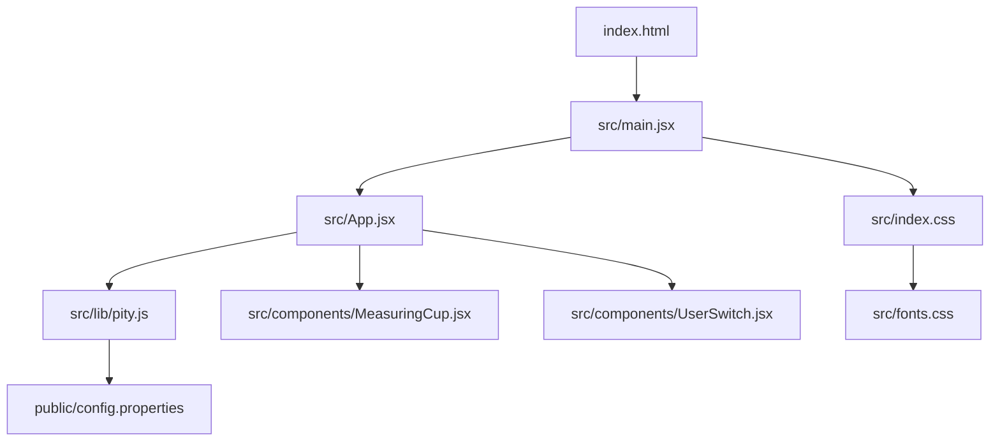
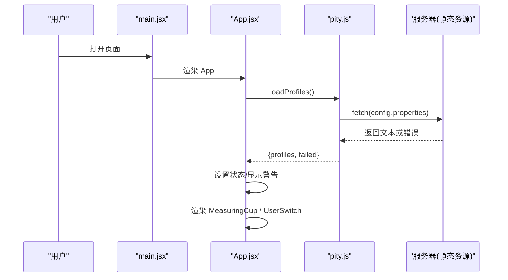
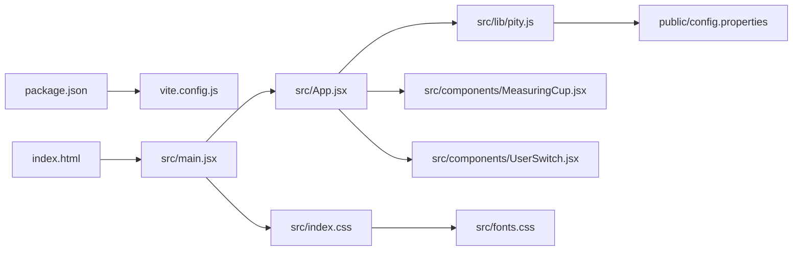
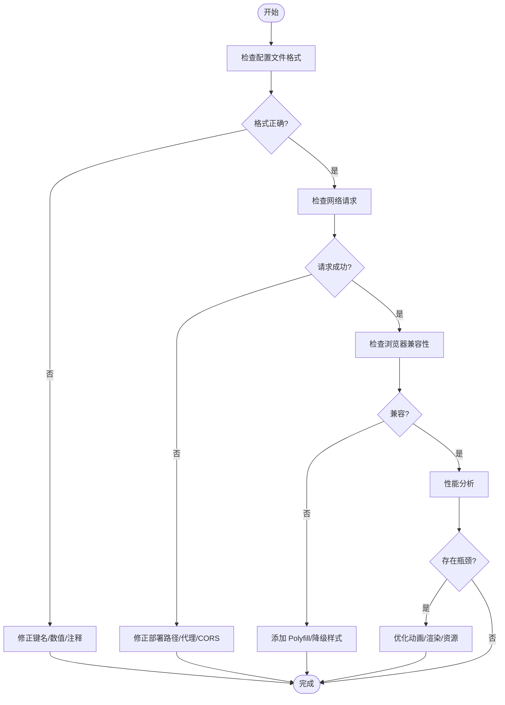

# 故障排除

<cite>
**本文引用的文件**
- [package.json](file://package.json)
- [vite.config.js](file://vite.config.js)
- [index.html](file://index.html)
- [src/main.jsx](file://src/main.jsx)
- [src/App.jsx](file://src/App.jsx)
- [src/lib/pity.js](file://src/lib/pity.js)
- [src/components/MeasuringCup.jsx](file://src/components/MeasuringCup.jsx)
- [src/components/UserSwitch.jsx](file://src/components/UserSwitch.jsx)
- [public/config.properties](file://public/config.properties)
- [src/index.css](file://src/index.css)
- [src/fonts.css](file://src/fonts.css)
</cite>

## 目录
1. [简介](#简介)
2. [项目结构](#项目结构)
3. [核心组件](#核心组件)
4. [架构总览](#架构总览)
5. [详细组件分析](#详细组件分析)
6. [依赖关系分析](#依赖关系分析)
7. [性能注意事项](#性能注意事项)
8. [故障排除指南](#故障排除指南)
9. [结论](#结论)
10. [附录：调试清单与最佳实践](#附录：调试清单与最佳实践)

## 简介
本指南面向初学者与有经验的开发者，聚焦于该项目的常见问题定位与解决，包括配置文件格式错误、网络请求失败、浏览器兼容性问题与性能瓶颈。文档同时提供调试技巧（开发者工具使用、日志输出方法、性能分析）、错误信息解读与处理策略、代码审查清单与最佳实践，以及社区支持与反馈渠道建议。

## 项目结构
该项目基于 Vite + React 构建，入口为 index.html，应用由 src/main.jsx 挂载到 #root，主界面在 src/App.jsx，业务逻辑集中在 src/lib/pity.js，UI 组件位于 src/components，样式在 src/index.css 与 src/fonts.css，配置数据通过 public/config.properties 提供。

图表来源
- [index.html:1-18](file://index.html#L1-L18)
- [src/main.jsx:1-11](file://src/main.jsx#L1-L11)
- [src/App.jsx:1-109](file://src/App.jsx#L1-L109)
- [src/lib/pity.js:1-73](file://src/lib/pity.js#L1-L73)
- [src/components/MeasuringCup.jsx:1-109](file://src/components/MeasuringCup.jsx#L1-L109)
- [src/components/UserSwitch.jsx:1-22](file://src/components/UserSwitch.jsx#L1-L22)
- [public/config.properties:1-21](file://public/config.properties#L1-L21)
- [src/index.css:1-710](file://src/index.css#L1-L710)
- [src/fonts.css:1-68](file://src/fonts.css#L1-L68)

章节来源
- [package.json:1-20](file://package.json#L1-L20)
- [vite.config.js:1-10](file://vite.config.js#L1-L10)
- [index.html:1-18](file://index.html#L1-L18)

## 核心组件
- 应用启动与渲染：main.jsx 创建根节点并挂载 App；App.jsx 负责加载配置、状态管理与页面布局。
- 配置读取与计算：pity.js 提供 loadProfiles、parseProfiles、calcPercent 等能力，支持从 config.properties 拉取数据并在失败时回退到内置兜底数据。
- 可视化与交互：MeasuringCup.jsx 绘制量杯进度与软保底线；UserSwitch.jsx 提供用户切换。
- 样式与字体：index.css 定义主题、动画与响应式布局；fonts.css 本地化字体资源，避免外部依赖不可达导致的样式问题。

章节来源
- [src/main.jsx:1-11](file://src/main.jsx#L1-L11)
- [src/App.jsx:1-109](file://src/App.jsx#L1-L109)
- [src/lib/pity.js:1-73](file://src/lib/pity.js#L1-L73)
- [src/components/MeasuringCup.jsx:1-109](file://src/components/MeasuringCup.jsx#L1-L109)
- [src/components/UserSwitch.jsx:1-22](file://src/components/UserSwitch.jsx#L1-L22)
- [src/index.css:1-710](file://src/index.css#L1-L710)
- [src/fonts.css:1-68](file://src/fonts.css#L1-L68)

## 架构总览
应用启动后，App 在首次渲染时调用 pity.js 的 loadProfiles 获取配置，解析成功后更新 profiles 状态；若失败则显示警告并使用兜底数据。MeasuringCup 根据百分比计算水位与软保底线，UserSwitch 切换当前用户以展示不同进度。

图表来源
- [src/main.jsx:6-10](file://src/main.jsx#L6-L10)
- [src/App.jsx:13-23](file://src/App.jsx#L13-L23)
- [src/lib/pity.js:61-72](file://src/lib/pity.js#L61-L72)

## 详细组件分析

### 配置加载与解析（pity.js）
- 功能要点
  - 常量定义：保底成本、单抽成本、软保底阈值。
  - parseProfiles：逐行解析 properties 文本，仅识别 userA/userB 前缀的键，忽略注释与空行，对数值字段进行合法性校验。
  - loadProfiles：拉取 public/config.properties，成功则解析，失败则返回兜底数据并标记 failed。
- 复杂度
  - parseProfiles 时间复杂度 O(N)，N 为配置行数；空间复杂度 O(1) 额外空间（结果对象固定大小）。
- 优化点
  - 可考虑缓存已解析的配置结果，减少重复解析。
  - 对异常行增加更详细的日志以便快速定位格式问题。
- 错误处理
  - 网络错误或 HTTP 非 2xx 会触发 catch，返回兜底数据并设置 failed=true，App 层据此显示提示。

章节来源
- [src/lib/pity.js:1-73](file://src/lib/pity.js#L1-L73)

### 应用主流程（App.jsx）
- 功能要点
  - useEffect 中调用 loadProfiles，异步设置 profiles 与 configFailed。
  - 未加载完成时显示“正在读取配置…”。
  - 配置失败时在头部显示警告提示。
  - 根据 active 用户计算偏移并渲染对应面板。
- 边界情况
  - 组件卸载时清理 mounted 标志，避免状态更新在卸载后执行。
  - 百分比被限制在 0-100 范围内，防止越界。
- 可访问性
  - 使用 aria-hidden、aria-label、role 等属性提升无障碍体验。

章节来源
- [src/App.jsx:1-109](file://src/App.jsx#L1-L109)

### 量杯可视化（MeasuringCup.jsx）
- 功能要点
  - 根据 percent 计算水面高度，生成前后波浪路径。
  - 绘制软保底线，当达到阈值时高亮。
  - 气泡与波浪动画增强视觉反馈。
- 性能
  - 使用 useMemo 缓存波浪路径，减少重绘开销。
  - 使用 will-change 与 transform 提升动画性能。
- 可访问性
  - SVG 带 role="img" 与 aria-label，便于屏幕阅读器理解。

章节来源
- [src/components/MeasuringCup.jsx:1-109](file://src/components/MeasuringCup.jsx#L1-L109)

### 用户切换（UserSwitch.jsx）
- 功能要点
  - 渲染两个用户的按钮，点击时调用 onChange 切换 active。
  - 使用 role="tablist"/"tab" 与 aria-selected 提升可访问性。
- 扩展性
  - ORDER 数组集中管理用户顺序，便于后续扩展更多用户。

章节来源
- [src/components/UserSwitch.jsx:1-22](file://src/components/UserSwitch.jsx#L1-L22)

## 依赖关系分析
- 构建与运行
  - package.json 声明 React 与 ReactDOM 依赖，Vite 作为构建工具与开发服务器。
  - vite.config.js 启用 React 插件并设置开发服务器端口。
- 运行时依赖
  - main.jsx 引入 App 与全局样式。
  - App.jsx 依赖 pity.js 与 UI 组件。
  - pity.js 依赖 fetch API 与 import.meta.env.BASE_URL。
  - 样式与字体通过 index.css 与 fonts.css 引入，字体本地化以避免外部网络不可用。

图表来源
- [package.json:1-20](file://package.json#L1-L20)
- [vite.config.js:1-10](file://vite.config.js#L1-L10)
- [index.html:1-18](file://index.html#L1-L18)
- [src/main.jsx:1-11](file://src/main.jsx#L1-L11)
- [src/App.jsx:1-109](file://src/App.jsx#L1-L109)
- [src/lib/pity.js:1-73](file://src/lib/pity.js#L1-L73)
- [src/components/MeasuringCup.jsx:1-109](file://src/components/MeasuringCup.jsx#L1-L109)
- [src/components/UserSwitch.jsx:1-22](file://src/components/UserSwitch.jsx#L1-L22)
- [public/config.properties:1-21](file://public/config.properties#L1-L21)
- [src/index.css:1-710](file://src/index.css#L1-L710)
- [src/fonts.css:1-68](file://src/fonts.css#L1-L68)

章节来源
- [package.json:1-20](file://package.json#L1-L20)
- [vite.config.js:1-10](file://vite.config.js#L1-L10)

## 性能注意事项
- 网络请求
  - loadProfiles 使用 no-store 缓存策略，确保每次拉取最新配置；在生产环境可考虑合理缓存以提升性能。
- 渲染优化
  - MeasuringCup 使用 useMemo 缓存路径，减少不必要的重新计算。
  - 动画使用 transform 与 will-change 提升合成层性能。
- 样式与字体
  - 字体本地化避免外部 CDN 不可达导致的阻塞；使用 preload 预加载关键字体。
- 内存与生命周期
  - App 在 useEffect 中维护 mounted 标志，避免卸载后状态更新导致泄漏。

[本节为通用性能指导，不直接分析具体文件]

## 故障排除指南

### 常见问题与解决方案

#### 1. 配置文件格式错误
- 现象
  - 页面顶部出现“配置文件读取失败，当前使用内置兜底数据”的提示；进度可能不符合预期。
- 原因
  - config.properties 中存在非法行、键名不匹配、数值为负或非数字等情况。
- 排查步骤
  - 检查每行是否以 key = value 形式书写，且键必须以 userA. 或 userB. 开头，支持的键为 fates、primogems、name。
  - 确认数值字段为非负数；name 可为空字符串。
  - 删除或修正注释行（以 # 或 ! 开头）与空行。
  - 在浏览器控制台查看是否有网络错误；必要时临时将 BASE_URL 指向正确的部署路径。
- 修复建议
  - 严格遵循 public/config.properties 中的格式说明。
  - 在 CI 中加入简单的格式校验脚本，提前发现错误。
- 相关实现参考
  - 解析逻辑与兜底机制：[src/lib/pity.js:31-72](file://src/lib/pity.js#L31-L72)
  - 警告提示渲染：[src/App.jsx:51-53](file://src/App.jsx#L51-L53)

章节来源
- [src/lib/pity.js:31-72](file://src/lib/pity.js#L31-L72)
- [src/App.jsx:51-53](file://src/App.jsx#L51-L53)
- [public/config.properties:1-21](file://public/config.properties#L1-L21)

#### 2. 网络请求失败
- 现象
  - 无法加载 config.properties；控制台出现 fetch 错误或 HTTP 状态码非 2xx。
- 原因
  - 部署路径不正确、跨域限制、服务器未提供该静态资源、BASE_URL 配置不当。
- 排查步骤
  - 在 Network 面板确认请求 URL 是否正确，是否返回 200。
  - 检查 vite.config.js 的 server.port 与部署时的 base 配置是否一致。
  - 若使用代理或反向代理，确认转发规则包含 /config.properties。
  - 验证 import.meta.env.BASE_URL 的值是否符合预期。
- 修复建议
  - 确保 public/config.properties 存在于构建产物根目录并可被访问。
  - 生产环境可考虑添加重试与超时控制，提升健壮性。
- 相关实现参考
  - 拉取与错误捕获：[src/lib/pity.js:61-72](file://src/lib/pity.js#L61-L72)
  - 开发服务器端口：[vite.config.js:6-8](file://vite.config.js#L6-L8)

章节来源
- [src/lib/pity.js:61-72](file://src/lib/pity.js#L61-L72)
- [vite.config.js:6-8](file://vite.config.js#L6-L8)

#### 3. 浏览器兼容性问题
- 现象
  - 页面样式错乱、动画不生效、字体未加载或报错。
- 原因
  - 旧版浏览器不支持某些 CSS 特性或 ES 语法；字体资源路径不正确。
- 排查步骤
  - 使用浏览器开发者工具的 Emulation 功能模拟旧版本浏览器。
  - 检查 Console 是否有语法错误或资源 404。
  - 确认 fonts.css 中字体路径与 public/fonts/ 下的文件一致。
  - 关注 index.css 中的媒体查询与动画，必要时降级处理。
- 修复建议
  - 使用 polyfill 或转译工具（如 Babel）覆盖目标浏览器。
  - 对不支持的特性提供降级样式（例如禁用动画）。
  - 使用 @media (prefers-reduced-motion: reduce) 尊重用户偏好。
- 相关实现参考
  - 字体声明与本地化：[src/fonts.css:1-68](file://src/fonts.css#L1-L68)
  - 动画与响应式：[src/index.css:91-164](file://src/index.css#L91-L164), [src/index.css:686-709](file://src/index.css#L686-L709)

章节来源
- [src/fonts.css:1-68](file://src/fonts.css#L1-L68)
- [src/index.css:91-164](file://src/index.css#L91-L164)
- [src/index.css:686-709](file://src/index.css#L686-L709)

#### 4. 性能瓶颈
- 现象
  - 页面卡顿、动画掉帧、首屏加载慢。
- 原因
  - 过多重排重绘、动画复杂、字体过大或网络延迟。
- 排查步骤
  - 使用 Performance 面板录制交互过程，查找长任务与频繁重绘。
  - 检查 MeasuringCup 的动画是否过度使用 transform 以外的属性。
  - 评估字体文件大小与加载策略，必要时拆分或懒加载。
  - 观察 Network 瀑布图，定位慢资源。
- 修复建议
  - 保持动画在合成层（transform、opacity），避免触发布局。
  - 使用 requestAnimationFrame 或 CSS 动画替代 JS 高频更新。
  - 对大资源启用压缩与缓存策略。
- 相关实现参考
  - 动画与性能优化：[src/components/MeasuringCup.jsx:28-29](file://src/components/MeasuringCup.jsx#L28-L29), [src/index.css:395-440](file://src/index.css#L395-L440)

章节来源
- [src/components/MeasuringCup.jsx:28-29](file://src/components/MeasuringCup.jsx#L28-L29)
- [src/index.css:395-440](file://src/index.css#L395-L440)

### 调试技巧与工具使用方法

#### 开发者工具使用
- 控制台（Console）
  - 查看 JavaScript 错误与警告；过滤网络错误。
- 网络（Network）
  - 检查 config.properties 的请求状态码、响应体与缓存策略。
- 元素（Elements）
  - 检查 DOM 结构与样式应用；验证 SVG 路径与类名。
- 性能（Performance）
  - 录制页面加载与交互，分析长任务与重排重绘热点。
- 存储（Storage）
  - 检查缓存与 Cookie，必要时清除缓存以复现问题。

#### 日志输出方法
- 在 loadProfiles 中添加 console.log 打印请求 URL、状态码与解析结果，便于定位网络与解析问题。
- 在 parseProfiles 中对异常行记录原始内容，辅助定位格式错误。
- 在 App 的状态更新处记录 profiles 与 configFailed，便于追踪渲染分支。

#### 性能分析技巧
- 使用 Performance 面板的“CPU 节流”模拟低端设备。
- 关闭动画（或使用 prefers-reduced-motion）对比性能差异。
- 使用 Memory 面板检测内存泄漏（如未清理的定时器或事件监听）。

### 错误信息的含义与处理策略

- HTTP 非 2xx
  - 含义：服务器未正确返回配置。
  - 处理：检查部署路径与服务器配置；必要时降级到兜底数据。
- 解析失败
  - 含义：properties 格式不符合预期。
  - 处理：修正键名前缀与字段类型；增加校验与日志。
- 字体加载失败
  - 含义：字体资源 404 或跨域限制。
  - 处理：确认 public/fonts/ 路径与文件名；检查 CSP 策略。
- 动画不生效
  - 含义：浏览器不支持或样式冲突。
  - 处理：降级处理；检查媒体查询与优先级。

章节来源
- [src/lib/pity.js:61-72](file://src/lib/pity.js#L61-L72)
- [src/fonts.css:1-68](file://src/fonts.css#L1-L68)
- [src/index.css:686-709](file://src/index.css#L686-L709)

### 代码审查清单与最佳实践

- 配置与数据
  - 所有新增键必须在前缀 userA/userB 下，且符合允许字段。
  - 数值字段需做非负校验；名称字段可为空。
- 网络请求
  - 明确超时与重试策略；生产环境考虑缓存与降级。
  - 使用环境变量管理 BASE_URL，避免硬编码。
- 组件设计
  - 保持组件职责单一；状态尽量上移，避免深层传递。
  - 使用受控组件与可访问性属性，提升用户体验。
- 性能
  - 优先使用 CSS 动画与 transform；避免频繁 DOM 操作。
  - 对昂贵计算使用 useMemo 或 useCallback。
- 兼容性
  - 目标浏览器特性矩阵明确；必要时提供降级方案。
  - 字体与资源本地化，减少外部依赖风险。

[本节为通用最佳实践，不直接分析具体文件]

### 社区支持与反馈渠道
- 项目仓库 Issues：提交 Bug 报告与功能请求，附上复现步骤与环境信息。
- Pull Requests：贡献修复与改进，遵循代码规范与测试要求。
- 讨论区：参与技术讨论，分享经验与解决方案。
- 文档与 Wiki：完善使用手册与常见问题解答。

[本节为通用建议，不直接分析具体文件]

## 结论
本项目通过清晰的模块划分与稳健的错误处理，提供了良好的可扩展性与可维护性。针对常见问题的排查路径明确，结合开发者工具与性能分析手段，能够快速定位并解决问题。建议在持续迭代中加强配置校验、网络健壮性与兼容性测试，以提升整体稳定性与用户体验。

## 附录：调试清单与最佳实践

### 快速定位流程图

[本图为概念性流程，不映射具体源码文件]

### 调试清单
- 配置
  - 确认键名前缀与字段合法；数值非负；注释行正确。
- 网络
  - 确认请求 URL、状态码、响应体；检查 BASE_URL 与代理。
- 浏览器
  - 检查 Console 错误；验证字体与样式加载；模拟旧版本。
- 性能
  - 录制 Performance；关注长任务与重排重绘；优化动画与资源。
- 可访问性
  - 验证 aria 属性与键盘导航；确保屏幕阅读器可读。

[本节为通用指导，不直接分析具体文件]