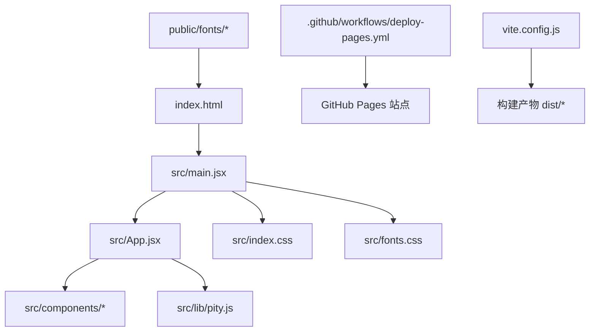
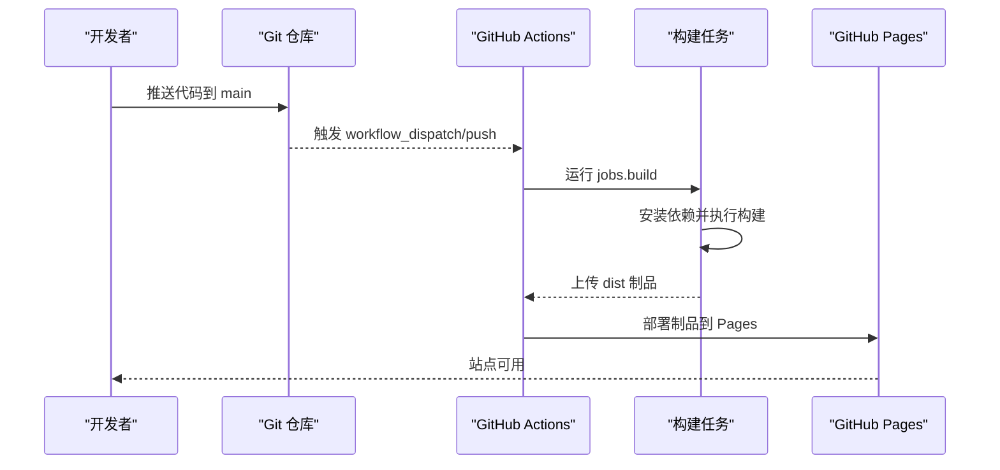
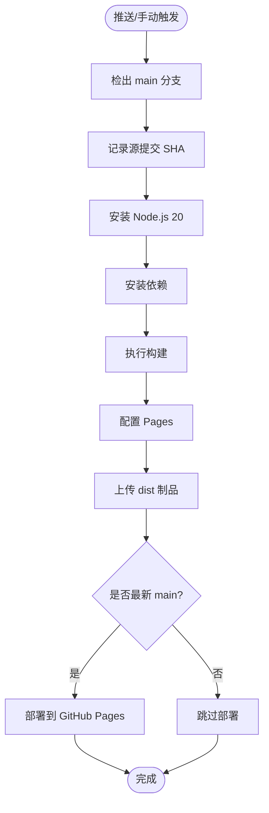
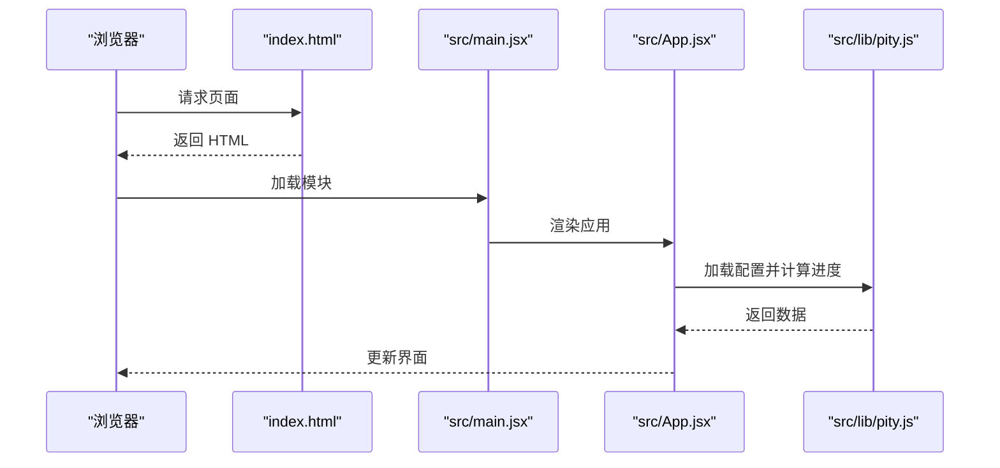
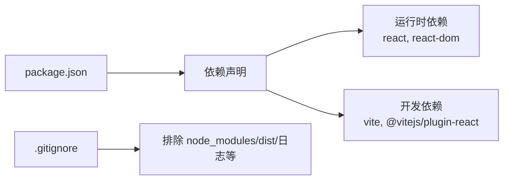

# 构建与部署

<cite>
**本文引用的文件**
- [package.json](file://package.json)
- [vite.config.js](file://vite.config.js)
- [.github/workflows/deploy-pages.yml](file://.github/workflows/deploy-pages.yml)
- [index.html](file://index.html)
- [src/main.jsx](file://src/main.jsx)
- [src/App.jsx](file://src/App.jsx)
- [src/index.css](file://src/index.css)
- [src/fonts.css](file://src/fonts.css)
- [.gitignore](file://.gitignore)
</cite>

## 目录
1. [简介](#简介)
2. [项目结构](#项目结构)
3. [核心组件](#核心组件)
4. [架构总览](#架构总览)
5. [详细组件分析](#详细组件分析)
6. [依赖分析](#依赖分析)
7. [性能考虑](#性能考虑)
8. [故障排除指南](#故障排除指南)
9. [结论](#结论)
10. [附录](#附录)

## 简介
本指南面向开发者与维护者，提供从本地开发到生产部署的完整流程说明。内容涵盖：
- 开发环境搭建要求（Node.js 版本、依赖安装、启动开发服务器）
- Vite 构建配置详解（开发/生产差异、插件与优化）
- GitHub Pages 自动化部署（CI/CD 流水线、分支策略、发布流程）
- 构建脚本使用（开发、构建、预览命令）
- 部署最佳实践、性能优化建议与常见问题排查

## 项目结构
本项目基于 Vite + React 的前端应用，入口为 index.html，通过 src/main.jsx 挂载 React 应用。构建产物输出至 dist 目录，由 GitHub Actions 自动部署到 GitHub Pages。

图表来源
- [index.html:1-18](file://index.html#L1-L18)
- [src/main.jsx:1-11](file://src/main.jsx#L1-L11)
- [src/App.jsx:1-109](file://src/App.jsx#L1-L109)
- [vite.config.js:1-10](file://vite.config.js#L1-L10)
- [.github/workflows/deploy-pages.yml:1-79](file://.github/workflows/deploy-pages.yml#L1-L79)

章节来源
- [index.html:1-18](file://index.html#L1-L18)
- [src/main.jsx:1-11](file://src/main.jsx#L1-L11)
- [src/App.jsx:1-109](file://src/App.jsx#L1-L109)
- [vite.config.js:1-10](file://vite.config.js#L1-L10)
- [.github/workflows/deploy-pages.yml:1-79](file://.github/workflows/deploy-pages.yml#L1-L79)

## 核心组件
- 构建工具链：Vite 5.x，React 插件 4.x
- 运行时依赖：React 18.x、ReactDOM 18.x
- 开发服务器：默认端口 5173
- 构建产物：dist 目录（静态资源）
- 自动化部署：GitHub Actions 工作流 deploy-pages.yml

章节来源
- [package.json:1-20](file://package.json#L1-L20)
- [vite.config.js:1-10](file://vite.config.js#L1-L10)
- [.github/workflows/deploy-pages.yml:1-79](file://.github/workflows/deploy-pages.yml#L1-L79)

## 架构总览
下图展示了从代码提交到线上站点发布的端到端流程，包括本地开发与 CI/CD 构建部署。

图表来源
- [.github/workflows/deploy-pages.yml:1-79](file://.github/workflows/deploy-pages.yml#L1-L79)

章节来源
- [.github/workflows/deploy-pages.yml:1-79](file://.github/workflows/deploy-pages.yml#L1-L79)

## 详细组件分析

### 开发环境与启动
- Node.js 版本要求
  - CI 使用 Node.js 20，建议在本地也使用 Node.js 20 以保证一致性。
- 依赖安装
  - 在项目根目录执行依赖安装命令以生成 node_modules。
- 启动开发服务器
  - 执行开发命令后，Vite 将在本地 5173 端口启动热重载服务。
- 构建与预览
  - 构建命令会生成 dist 静态资源；预览命令用于本地预览构建产物。

章节来源
- [package.json:6-10](file://package.json#L6-L10)
- [vite.config.js:6-8](file://vite.config.js#L6-L8)
- [.github/workflows/deploy-pages.yml:34-43](file://.github/workflows/deploy-pages.yml#L34-L43)

### Vite 构建配置
- 插件
  - 启用 @vitejs/plugin-react，支持 JSX 语法与 React 快速刷新。
- 开发服务器
  - 默认端口 5173，可在配置中调整。
- 构建模式差异
  - 开发模式：启用热更新、源码映射等，便于调试。
  - 生产模式：进行代码分割、压缩、Tree Shaking 等优化，输出至 dist。
- 资源与字体
  - 字体已本地化在 public/fonts，并在 HTML 中使用 preload 预加载，避免网络不可达导致的样式失败。

章节来源
- [vite.config.js:1-10](file://vite.config.js#L1-L10)
- [index.html:7-10](file://index.html#L7-L10)

### GitHub Pages 自动化部署
- 触发条件
  - 推送到 main 分支或手动触发 workflow_dispatch。
- 权限与并发
  - 授予读取仓库、写入 Pages、ID Token 写入权限；设置并发组 pages，取消进行中的任务。
- 构建任务
  - 检出 main 分支，记录源提交 SHA，安装依赖，执行构建，配置 Pages，上传 dist 制品。
- 部署任务
  - 校验制品是否为最新 main 分支提交，若是则部署到 GitHub Pages。
- 分支策略
  - 仅对 main 分支进行自动部署；其他分支需合并至 main 才会触发。

图表来源
- [.github/workflows/deploy-pages.yml:1-79](file://.github/workflows/deploy-pages.yml#L1-L79)

章节来源
- [.github/workflows/deploy-pages.yml:1-79](file://.github/workflows/deploy-pages.yml#L1-L79)

### 应用入口与渲染流程
- HTML 入口
  - index.html 定义页面元信息、主题色、字体预加载，并通过 script 模块引入 src/main.jsx。
- React 挂载
  - src/main.jsx 创建根节点并渲染 App 组件，同时引入全局样式。
- 业务逻辑
  - src/App.jsx 负责数据加载、状态切换与 UI 展示，调用 lib/pity.js 计算进度。

图表来源
- [index.html:1-18](file://index.html#L1-L18)
- [src/main.jsx:1-11](file://src/main.jsx#L1-L11)
- [src/App.jsx:1-109](file://src/App.jsx#L1-L109)

章节来源
- [index.html:1-18](file://index.html#L1-L18)
- [src/main.jsx:1-11](file://src/main.jsx#L1-L11)
- [src/App.jsx:1-109](file://src/App.jsx#L1-L109)

## 依赖分析
- 运行时依赖
  - react、react-dom：用于构建 React 应用。
- 开发依赖
  - vite、@vitejs/plugin-react：构建工具与 React 插件。
- 忽略规则
  - .gitignore 排除了 node_modules、dist、日志与编辑器临时文件，确保仓库整洁。

图表来源
- [package.json:11-18](file://package.json#L11-L18)
- [.gitignore:1-16](file://.gitignore#L1-L16)

章节来源
- [package.json:11-18](file://package.json#L1-L18)
- [.gitignore:1-16](file://.gitignore#L1-L16)

## 性能考虑
- 字体本地化与预加载
  - 字体文件放置于 public/fonts，并在 HTML 中使用 preload 预加载，减少首屏阻塞与跨域风险。
- 构建优化
  - 生产构建会自动进行代码分割、压缩与 Tree Shaking，减小包体积。
- 资源缓存
  - 静态资源由 GitHub Pages 提供 CDN 缓存，合理命名与版本控制可提升缓存命中率。
- 监控与度量
  - 可通过浏览器开发者工具与 Lighthouse 评估首屏时间、资源大小与可访问性。

章节来源
- [index.html:7-10](file://index.html#L7-L10)
- [vite.config.js:1-10](file://vite.config.js#L1-L10)

## 故障排除指南
- 依赖安装失败
  - 检查 Node.js 版本是否与 CI 一致（推荐 Node.js 20），清理缓存后重试安装。
- 开发服务器无法启动
  - 确认端口未被占用（默认 5173），查看终端错误日志定位冲突。
- 构建失败
  - 检查是否有未安装的依赖或语法错误；确保 React 插件已正确引入。
- 字体加载失败
  - 确认 public/fonts 下存在对应 woff2 文件，且 HTML 中 preload 路径正确。
- 部署未生效
  - 确认推送分支为 main；检查 GitHub Actions 运行日志；验证制品是否为最新 main 提交。

章节来源
- [package.json:6-10](file://package.json#L6-L10)
- [vite.config.js:6-8](file://vite.config.js#L6-L8)
- [index.html:7-10](file://index.html#L7-L10)
- [.github/workflows/deploy-pages.yml:34-79](file://.github/workflows/deploy-pages.yml#L34-L79)

## 结论
本项目采用 Vite + React 的现代前端工程化方案，配合 GitHub Actions 实现一键部署到 GitHub Pages。通过本地一致的 Node.js 版本、规范的依赖管理与清晰的构建配置，确保了开发体验与生产稳定性。遵循本文的最佳实践与故障排除步骤，可高效推进迭代与发布。

## 附录
- 常用命令
  - 开发：npm run dev
  - 构建：npm run build
  - 预览：npm run preview
- 环境变量与配置
  - 如需自定义端口或其他行为，可在 vite.config.js 中扩展 server 与构建选项。
- 分支策略建议
  - 日常开发在功能分支进行，完成后合并至 main 触发自动部署。

章节来源
- [package.json:6-10](file://package.json#L6-L10)
- [vite.config.js:1-10](file://vite.config.js#L1-L10)
- [.github/workflows/deploy-pages.yml:1-79](file://.github/workflows/deploy-pages.yml#L1-L79)