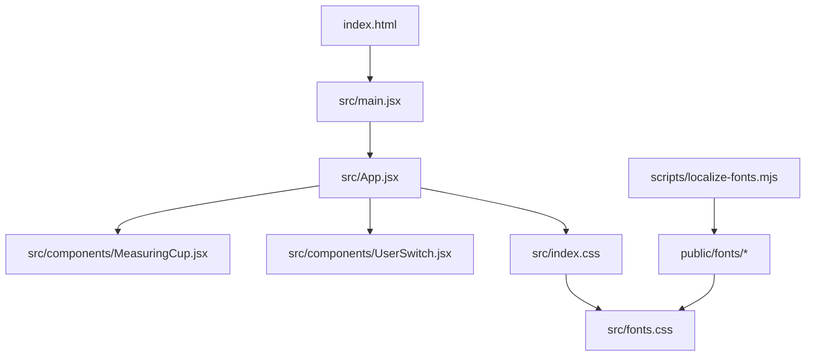
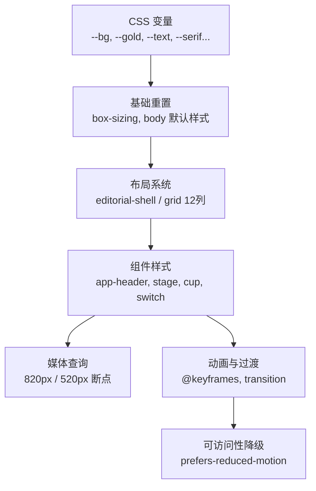
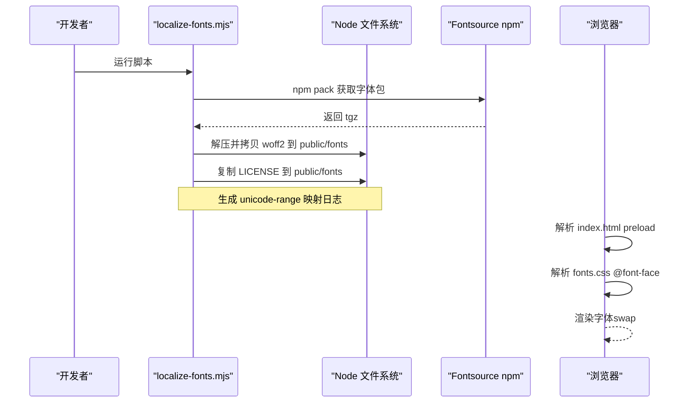
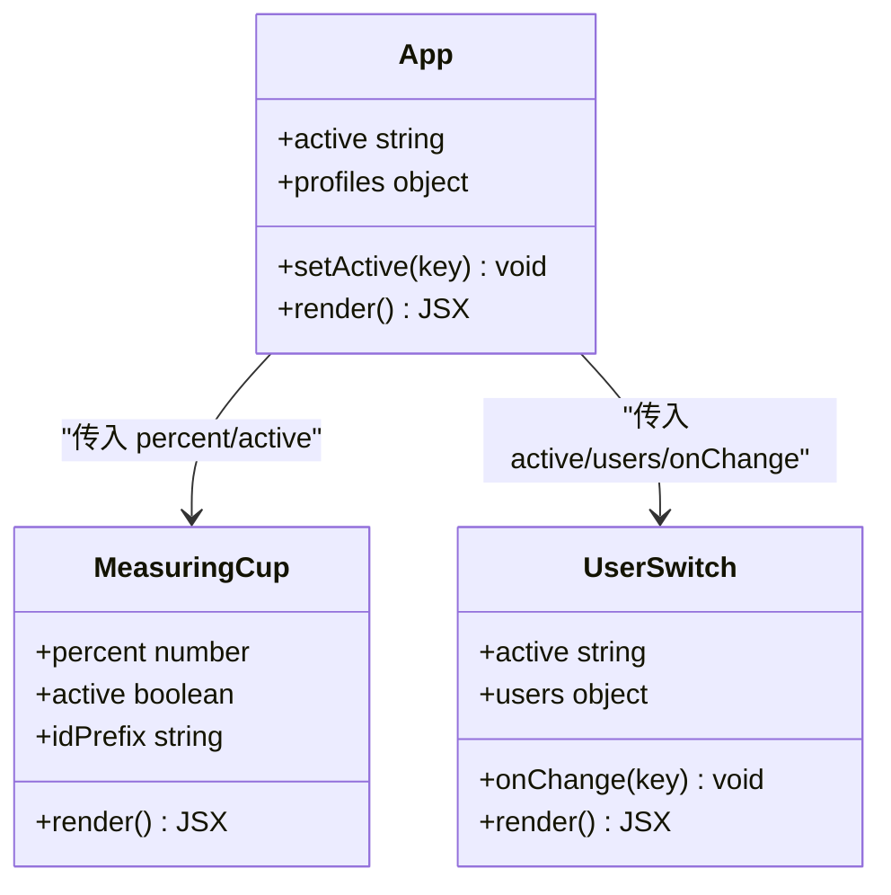
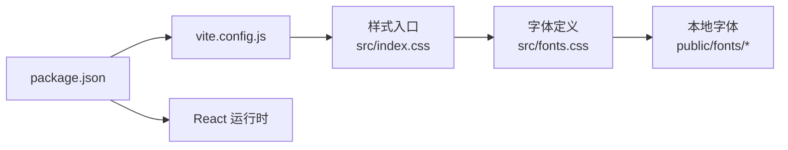

# 样式与主题

<cite>
**本文引用的文件**
- [src/index.css](file://src/index.css)
- [src/fonts.css](file://src/fonts.css)
- [index.html](file://index.html)
- [scripts/localize-fonts.mjs](file://scripts/localize-fonts.mjs)
- [src/App.jsx](file://src/App.jsx)
- [src/components/MeasuringCup.jsx](file://src/components/MeasuringCup.jsx)
- [src/components/UserSwitch.jsx](file://src/components/UserSwitch.jsx)
- [package.json](file://package.json)
- [vite.config.js](file://vite.config.js)
- [public/config.properties](file://public/config.properties)
</cite>

## 目录
1. [简介](#简介)
2. [项目结构](#项目结构)
3. [核心组件](#核心组件)
4. [架构总览](#架构总览)
5. [详细组件分析](#详细组件分析)
6. [依赖关系分析](#依赖关系分析)
7. [性能考量](#性能考量)
8. [故障排查指南](#故障排查指南)
9. [结论](#结论)
10. [附录：主题定制指南](#附录：主题定制指南)

## 简介
本文件面向样式系统与主题定制，系统性说明项目的 CSS 架构、CSS 变量体系、响应式布局与动画方案、字体加载策略（Inter、Playfair Display、Playwrite DE SAS Guides）、颜色系统、移动端适配、主题定制方法、最佳实践与性能优化建议，以及常见兼容性问题的解决方案。目标是帮助开发者快速理解并安全地扩展或调整视觉风格与交互体验。

## 项目结构
本项目采用 Vite + React 的工程结构，样式集中在 src/index.css 中，字体定义在 src/fonts.css，并通过 index.html 对关键字体进行预加载。脚本 scripts/localize-fonts.mjs 负责从 Fontsource 拉取 woff2 到 public/fonts，实现字体本地化与许可证同步。

图表来源
- [index.html:1-18](file://index.html#L1-L18)
- [src/App.jsx:1-109](file://src/App.jsx#L1-L109)
- [src/components/MeasuringCup.jsx:1-109](file://src/components/MeasuringCup.jsx#L1-L109)
- [src/components/UserSwitch.jsx:1-22](file://src/components/UserSwitch.jsx#L1-L22)
- [src/index.css:1-710](file://src/index.css#L1-L710)
- [src/fonts.css:1-68](file://src/fonts.css#L1-L68)
- [scripts/localize-fonts.mjs:1-72](file://scripts/localize-fonts.mjs#L1-L72)

章节来源
- [index.html:1-18](file://index.html#L1-L18)
- [src/index.css:1-710](file://src/index.css#L1-L710)
- [src/fonts.css:1-68](file://src/fonts.css#L1-L68)
- [scripts/localize-fonts.mjs:1-72](file://scripts/localize-fonts.mjs#L1-L72)

## 核心组件
- 全局样式与主题变量：通过 :root 定义颜色、字体族、缓动函数等，统一全局主题。
- 网格与布局：使用 CSS Grid 构建 12 列编辑排版网格，配合 clamp() 实现弹性间距。
- 动画系统：基于 @keyframes 的呼吸光晕、星空、水位上升、波浪、气泡等动画，结合 prefers-reduced-motion 提供无障碍降级。
- 组件样式：量杯可视化、用户切换条、指标展示等，均通过语义化类名组织。

章节来源
- [src/index.css:3-19](file://src/index.css#L3-L19)
- [src/index.css:55-77](file://src/index.css#L55-L77)
- [src/index.css:91-164](file://src/index.css#L91-L164)
- [src/index.css:166-709](file://src/index.css#L166-L709)

## 架构总览
样式层由“变量层 → 基础层 → 布局层 → 组件层 → 媒体查询层”构成，遵循 BEM 风格的命名约定，便于维护与扩展。

图表来源
- [src/index.css:3-19](file://src/index.css#L3-L19)
- [src/index.css:21-39](file://src/index.css#L21-L39)
- [src/index.css:55-77](file://src/index.css#L55-L77)
- [src/index.css:91-164](file://src/index.css#L91-L164)
- [src/index.css:572-709](file://src/index.css#L572-L709)

## 详细组件分析

### 颜色系统与主题变量
- 设计令牌：在 :root 中集中声明背景、表面色、强调色（金色）、文本色、线条色、缓动曲线与字体族变量。
- 使用方式：组件样式通过 var(--xxx) 引用，确保主题一致性。
- 可扩展性：新增主题只需覆盖 :root 中的变量即可生效于全站点。

章节来源
- [src/index.css:3-19](file://src/index.css#L3-L19)

### 字体加载策略与本地化
- 字体清单：Inter（正文无衬线）、Playfair Display（标题与数字）、Playwrite DE SAS Guides（手写体用户名）。
- 本地化机制：通过 scripts/localize-fonts.mjs 从 Fontsource 拉取 woff2 至 public/fonts，并复制 OFL 许可证；src/fonts.css 使用 @font-face 指向本地路径，避免外部依赖。
- 预加载优化：index.html 中对关键字体使用 rel="preload" as="font"，减少首屏 FOIT/FOUT。
- Unicode 子集：按 latin / latin-ext 拆分字体，降低体积；中文使用系统字体回退。

图表来源
- [scripts/localize-fonts.mjs:1-72](file://scripts/localize-fonts.mjs#L1-L72)
- [src/fonts.css:1-68](file://src/fonts.css#L1-L68)
- [index.html:1-18](file://index.html#L1-L18)

章节来源
- [src/fonts.css:1-68](file://src/fonts.css#L1-L68)
- [index.html:1-18](file://index.html#L1-L18)
- [scripts/localize-fonts.mjs:1-72](file://scripts/localize-fonts.mjs#L1-L72)

### 响应式设计与移动端适配
- 栅格系统：12 列网格，列宽与间距使用 min()、clamp() 实现弹性缩放。
- 断点策略：
  - 820px：头部跨列、舞台高度调整、指标右对齐、SVG 尺寸缩小。
  - 520px：网格列数缩减为 6 列，字号与间距进一步压缩，保证小屏可读性。
- 可访问性：prefers-reduced-motion 下禁用非必要动画与过渡。

章节来源
- [src/index.css:55-77](file://src/index.css#L55-L77)
- [src/index.css:572-684](file://src/index.css#L572-L684)
- [src/index.css:686-709](file://src/index.css#L686-L709)

### 动画效果与性能
- 环境氛围：ambient 光晕使用 blur + will-change: transform 提升合成性能。
- 星空背景：多层 radial-gradient 叠加，配合 background-position 与 opacity 动画。
- 量杯水位：waterRise 入场动画，wave-front/back 水平平移形成波浪，bubble 上浮。
- 过渡控制：cups-track、switch-thumb、面板元素使用 cubic-bezier 缓动，提升交互质感。
- 无障碍降级：prefers-reduced-motion 关闭所有动画与过渡。

章节来源
- [src/index.css:91-164](file://src/index.css#L91-L164)
- [src/index.css:246-255](file://src/index.css#L246-L255)
- [src/index.css:374-440](file://src/index.css#L374-L440)
- [src/index.css:497-570](file://src/index.css#L497-L570)
- [src/index.css:686-709](file://src/index.css#L686-L709)

### 组件样式与交互
- 量杯（MeasuringCup）：SVG 绘制玻璃容器、渐变水体、刻度线与阈值虚线；active 时触发入场动画。
- 用户切换（UserSwitch）：双标签页切换，底部指示条随 active 状态滑动。
- 指标展示（percent）：大号数值与百分比符号，达到保底阈值时高亮强调。

图表来源
- [src/components/MeasuringCup.jsx:1-109](file://src/components/MeasuringCup.jsx#L1-L109)
- [src/components/UserSwitch.jsx:1-22](file://src/components/UserSwitch.jsx#L1-L22)
- [src/App.jsx:1-109](file://src/App.jsx#L1-L109)

章节来源
- [src/components/MeasuringCup.jsx:1-109](file://src/components/MeasuringCup.jsx#L1-L109)
- [src/components/UserSwitch.jsx:1-22](file://src/components/UserSwitch.jsx#L1-L22)
- [src/App.jsx:1-109](file://src/App.jsx#L1-L109)

## 依赖关系分析
- 构建工具：Vite 提供开发服务器与打包能力，React 插件启用 JSX。
- 运行时依赖：React 与 ReactDOM。
- 样式依赖：无第三方 UI 库，纯原生 CSS 实现。
- 字体依赖：Fontsource 提供的 woff2 变体，通过脚本本地化后不再依赖外网。

图表来源
- [package.json:1-20](file://package.json#L1-L20)
- [vite.config.js:1-10](file://vite.config.js#L1-L10)
- [src/index.css:1-710](file://src/index.css#L1-L710)
- [src/fonts.css:1-68](file://src/fonts.css#L1-L68)

章节来源
- [package.json:1-20](file://package.json#L1-L20)
- [vite.config.js:1-10](file://vite.config.js#L1-L10)

## 性能考量
- 字体加载：
  - 使用 font-display: swap 避免阻塞渲染。
  - index.html 中对关键字体进行 preload，缩短首屏白屏时间。
  - 仅引入 latin / latin-ext 子集，减小体积。
- 动画性能：
  - 大量使用 will-change 与 transform 以启用 GPU 加速。
  - 复杂背景使用径向渐变与 mask-image，减少 DOM 节点数量。
- 可访问性：
  - 尊重 prefers-reduced-motion，自动禁用动画与过渡。
- 构建与缓存：
  - Vite 默认开启生产优化，静态资源（字体、图片）可被长期缓存。

章节来源
- [src/fonts.css:1-68](file://src/fonts.css#L1-L68)
- [index.html:1-18](file://index.html#L1-L18)
- [src/index.css:91-164](file://src/index.css#L91-L164)
- [src/index.css:686-709](file://src/index.css#L686-L709)

## 故障排查指南
- 字体不显示或闪烁：
  - 确认 public/fonts 中存在对应 woff2 文件，且 src/fonts.css 的 @font-face 路径正确。
  - 检查 index.html 是否包含对应字体的 preload 链接。
  - 若网络受限，确保已运行 scripts/localize-fonts.mjs 完成本地化。
- 动画异常或卡顿：
  - 检查是否误用会触发重绘的属性（如 width/height），优先使用 transform。
  - 在低性能设备上，考虑减少同时运行的动画数量。
- 移动端布局错乱：
  - 核对 820px / 520px 媒体查询内的栅格列跨度与字号设置。
  - 确认 SVG 尺寸在小屏下已按比例缩小。
- 主题变量未生效：
  - 确认 :root 中的变量已正确定义并被 var(--xxx) 引用。
  - 检查是否存在同名类覆盖导致优先级问题。

章节来源
- [src/fonts.css:1-68](file://src/fonts.css#L1-L68)
- [index.html:1-18](file://index.html#L1-L18)
- [src/index.css:572-684](file://src/index.css#L572-L684)
- [src/index.css:686-709](file://src/index.css#L686-L709)

## 结论
本项目采用现代 CSS 架构，通过变量驱动的主题系统、弹性栅格布局与精心设计的动画，实现了高质量的视觉表现与良好的可维护性。字体本地化与预加载策略确保了跨环境的稳定渲染。遵循本文档的最佳实践与定制指南，可安全扩展主题与视觉效果，同时保持性能与可访问性。

## 附录：主题定制指南

### 修改颜色方案
- 目标：全局调整品牌色、背景、文本与强调色。
- 步骤：
  - 打开 src/index.css，定位 :root 块。
  - 修改以下变量以统一主题：
    - 背景与表面：--bg, --surface, --surface-strong
    - 强调色：--gold, --gold-soft, --gold-pale
    - 辅助色：--blue-soft
    - 文本与线条：--text, --text-dim, --line, --line-soft
  - 保存后刷新页面，观察全局变化。
- 注意事项：
  - 保持对比度符合可访问性要求（WCAG）。
  - 如需新增主题开关，可在根节点动态切换 data-theme 并在 :root[data-theme] 中覆盖变量。

章节来源
- [src/index.css:3-19](file://src/index.css#L3-L19)

### 修改字体设置
- 目标：替换或调整字体族与加载行为。
- 步骤：
  - 在 src/index.css 的 :root 中更新 --serif, --sans, --hand 的字体栈顺序。
  - 如需更换字体文件：
    - 将新字体 woff2 放入 public/fonts。
    - 在 src/fonts.css 中添加或替换 @font-face，配置 unicode-range。
    - 在 index.html 中添加对应字体的 preload 链接。
    - 可选：运行 scripts/localize-fonts.mjs 以自动化下载与许可证管理。
- 注意事项：
  - 中文内容建议使用系统字体回退，避免额外字体体积。
  - 使用 font-display: swap 改善首屏体验。

章节来源
- [src/index.css:3-19](file://src/index.css#L3-L19)
- [src/fonts.css:1-68](file://src/fonts.css#L1-L68)
- [index.html:1-18](file://index.html#L1-L18)
- [scripts/localize-fonts.mjs:1-72](file://scripts/localize-fonts.mjs#L1-L72)

### 调整视觉效果与动画
- 目标：增强或减弱动效强度。
- 步骤：
  - 调整 .ambient 的 blur、opacity 与动画时长，改变氛围光晕强度。
  - 调整 .stars 的背景尺寸与动画时长，改变星空密度与速度。
  - 调整 .cups-track、.switch-thumb 的 transition 时长与缓动曲线，改变交互顺滑度。
  - 在 prefers-reduced-motion 下确保动画被禁用，保障可访问性。
- 注意事项：
  - 避免同时过多动画叠加，防止低端设备卡顿。
  - 使用 transform 与 opacity 提升合成性能。

章节来源
- [src/index.css:91-164](file://src/index.css#L91-L164)
- [src/index.css:246-255](file://src/index.css#L246-L255)
- [src/index.css:497-570](file://src/index.css#L497-L570)
- [src/index.css:686-709](file://src/index.css#L686-L709)

### 布局与移动端适配策略
- 目标：在不同屏幕尺寸下保持良好阅读与操作体验。
- 步骤：
  - 使用 clamp() 与 min() 控制间距与字号，确保弹性缩放。
  - 在 820px / 520px 断点下调整栅格列跨度、行高与对齐方式。
  - 在小屏上适当增大触摸区域，提升可操作性。
- 注意事项：
  - 避免固定宽度导致的溢出，优先使用相对单位。
  - 测试不同设备方向与缩放比例下的表现。

章节来源
- [src/index.css:55-77](file://src/index.css#L55-L77)
- [src/index.css:572-684](file://src/index.css#L572-L684)

### 样式最佳实践
- 使用语义化类名与 BEM 风格，便于维护与复用。
- 将设计令牌集中于 :root，避免硬编码颜色与尺寸。
- 优先使用 CSS Grid 与 Flexbox 构建布局，减少嵌套层级。
- 动画与过渡尽量使用 transform 与 opacity，提升性能。
- 始终考虑可访问性：提供焦点可见、键盘导航与减少动效支持。

章节来源
- [src/index.css:21-39](file://src/index.css#L21-L39)
- [src/index.css:55-77](file://src/index.css#L55-L77)
- [src/index.css:686-709](file://src/index.css#L686-L709)

### 常见问题与兼容性
- 字体加载失败：
  - 确认 public/fonts 存在对应文件，且路径正确。
  - 检查浏览器控制台是否有 CORS 或 404 错误。
- 动画不生效：
  - 检查是否被 prefers-reduced-motion 禁用。
  - 确认动画属性未被其他样式覆盖。
- 移动端错位：
  - 核对媒体查询断点与栅格列跨度。
  - 检查 SVG 在小屏下的缩放与对齐。
- 主题变量无效：
  - 确认变量已在 :root 定义并被 var() 引用。
  - 检查选择器优先级冲突。

章节来源
- [src/fonts.css:1-68](file://src/fonts.css#L1-L68)
- [src/index.css:572-684](file://src/index.css#L572-L684)
- [src/index.css:686-709](file://src/index.css#L686-L709)