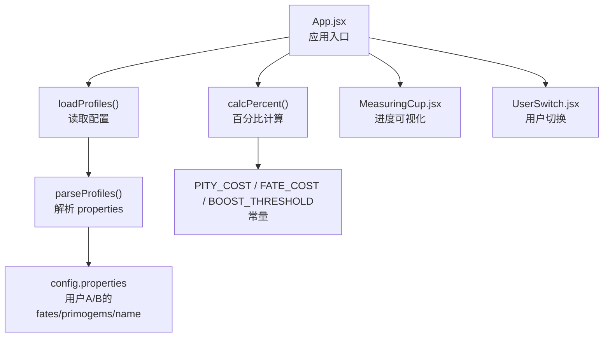
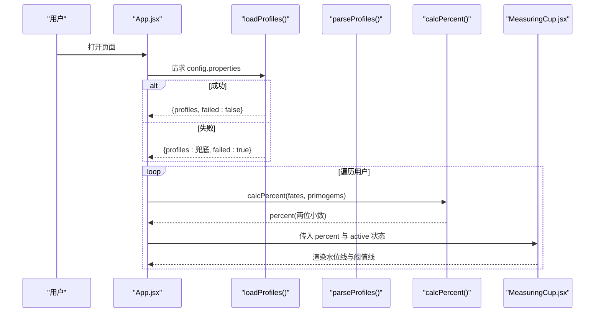
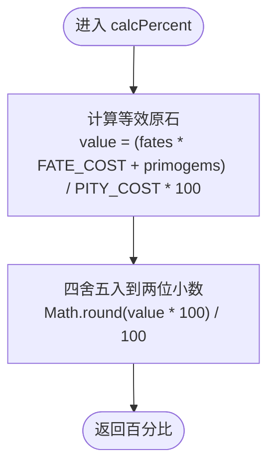
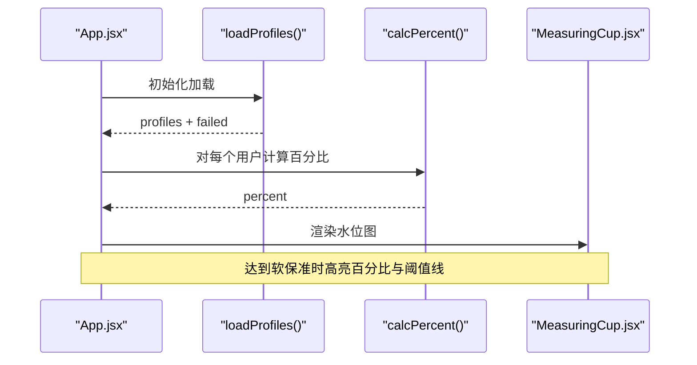
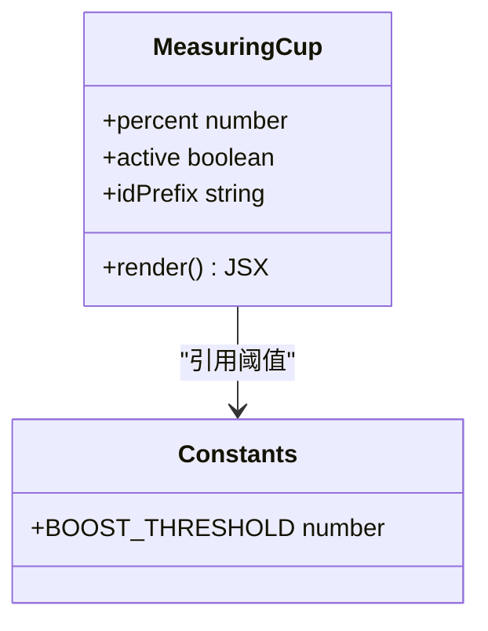
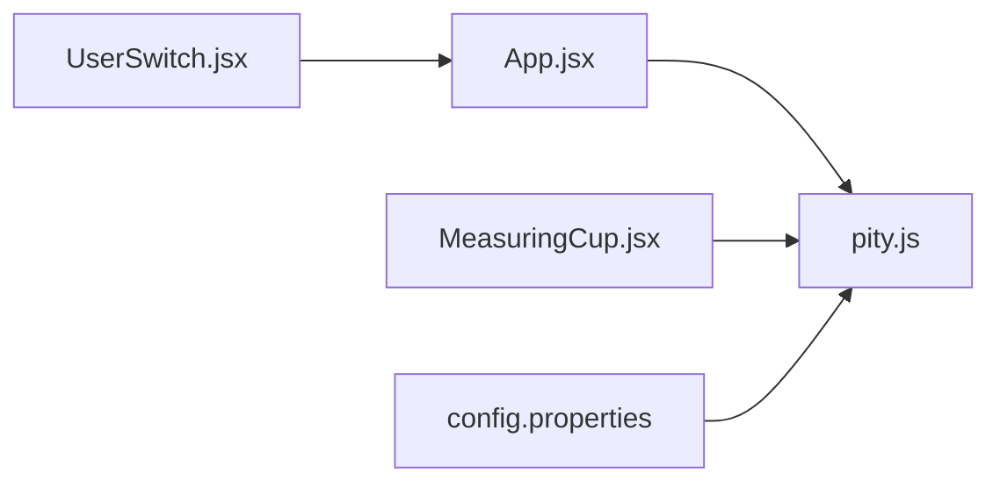

# 保底计算引擎

<cite>
**本文引用的文件**
- [pity.js](file://src/lib/pity.js)
- [App.jsx](file://src/App.jsx)
- [MeasuringCup.jsx](file://src/components/MeasuringCup.jsx)
- [UserSwitch.jsx](file://src/components/UserSwitch.jsx)
- [config.properties](file://public/config.properties)
- [package.json](file://package.json)
</cite>

## 目录
1. [简介](#简介)
2. [项目结构](#项目结构)
3. [核心组件](#核心组件)
4. [架构总览](#架构总览)
5. [详细组件分析](#详细组件分析)
6. [依赖关系分析](#依赖关系分析)
7. [性能考量](#性能考量)
8. [故障排查指南](#故障排查指南)
9. [结论](#结论)
10. [附录：调用示例与边界处理](#附录调用示例与边界处理)

## 简介
本引擎围绕“90抽保底”的核心机制，提供从配置读取、资源折算到百分比计算的完整流程。重点包括：
- 常量定义：PITY_COST（一个保底=14400原石）、FATE_COST（一抽=160原石）、BOOST_THRESHOLD（软保底阈值=82%）。
- 计算函数：calcPercent 将纠缠之缘与原石统一折算为“等效原石”，再除以保底成本得到百分比，并保留两位小数。
- 数据交互：通过 loadProfiles 拉取 public/config.properties，解析后供 UI 渲染；失败时回退到内置兜底数据。
- 可视化：MeasuringCup 根据百分比绘制水位线，并在达到或超过软保底阈值时高亮提示。

## 项目结构
本项目基于 React + Vite，核心逻辑集中在 src/lib/pity.js，UI 层由 App.jsx 组合 MeasuringCup.jsx 与 UserSwitch.jsx 完成展示与交互，配置文件位于 public/config.properties。

图表来源
- [App.jsx:1-109](file://src/App.jsx#L1-L109)
- [pity.js:1-73](file://src/lib/pity.js#L1-L73)
- [MeasuringCup.jsx:1-109](file://src/components/MeasuringCup.jsx#L1-L109)
- [UserSwitch.jsx:1-22](file://src/components/UserSwitch.jsx#L1-L22)
- [config.properties:1-21](file://public/config.properties#L1-L21)

章节来源
- [App.jsx:1-109](file://src/App.jsx#L1-L109)
- [pity.js:1-73](file://src/lib/pity.js#L1-L73)
- [config.properties:1-21](file://public/config.properties#L1-L21)

## 核心组件
- 常量与工具
  - PITY_COST：一个保底所需的原石总量（14400）。
  - FATE_COST：单次抽取消耗的原石（160）。
  - BOOST_THRESHOLD：软保底起点百分比（82%），用于视觉与业务提示。
  - calcPercent(fates, primogems)：将 fates 与 primogems 折算为百分比，结果保留两位小数。
  - parseProfiles(text)：解析 properties 文本，仅识别 userA/userB 的 fates、primogems、name。
  - loadProfiles()：异步拉取 config.properties，失败则返回兜底数据。
- UI 组件
  - App.jsx：加载配置、计算百分比、渲染进度条与用户切换。
  - MeasuringCup.jsx：根据百分比绘制水位线，并在达到软保底阈值时高亮阈值线。
  - UserSwitch.jsx：在 userA 与 userB 之间切换当前激活的用户。

章节来源
- [pity.js:1-73](file://src/lib/pity.js#L1-L73)
- [App.jsx:1-109](file://src/App.jsx#L1-L109)
- [MeasuringCup.jsx:1-109](file://src/components/MeasuringCup.jsx#L1-L109)
- [UserSwitch.jsx:1-22](file://src/components/UserSwitch.jsx#L1-L22)

## 架构总览
整体数据流如下：
- 启动时 App.jsx 调用 loadProfiles() 获取 profiles。
- 对每个用户，使用 calcPercent(fates, primogems) 计算百分比。
- 将百分比传入 MeasuringCup 进行可视化，同时根据是否达到 BOOST_THRESHOLD 进行样式高亮。
- 若配置文件不可用，自动降级到内置兜底数据，保证可用性。

图表来源
- [App.jsx:13-23](file://src/App.jsx#L13-L23)
- [App.jsx:69-100](file://src/App.jsx#L69-L100)
- [pity.js:62-72](file://src/lib/pity.js#L62-L72)
- [pity.js:22-25](file://src/lib/pity.js#L22-L25)
- [MeasuringCup.jsx:17-42](file://src/components/MeasuringCup.jsx#L17-L42)

## 详细组件分析

### 常量与计算核心（pity.js）
- 常量
  - PITY_COST = 14400：一个保底所需原石总数。
  - FATE_COST = 160：一次抽取消耗原石数。
  - BOOST_THRESHOLD = 82：软保底触发百分比阈值。
- calcPercent(fates, primogems)
  - 公式：percent = ((fates × FATE_COST + primogems) / PITY_COST) × 100
  - 精度控制：Math.round(value × 100) / 100，确保结果为两位小数。
  - 复杂度：O(1)，无分支与循环。
- parseProfiles(text)
  - 支持键：userA.fates、userA.primogems、userA.name 以及 userB 对应键。
  - 忽略注释行（以 # 或 ! 开头）与空行。
  - 数值校验：非负整数才生效。
- loadProfiles()
  - 拉取 public/config.properties，设置 no-store 避免缓存。
  - 失败时返回兜底数据 FALLBACK_PROFILES，并标记 failed=true。

图表来源
- [pity.js:22-25](file://src/lib/pity.js#L22-L25)

章节来源
- [pity.js:1-73](file://src/lib/pity.js#L1-L73)

### 应用装配与数据流（App.jsx）
- 生命周期
  - useEffect 中调用 loadProfiles()，成功后更新 profiles 与 configFailed 状态。
- 渲染流程
  - 遍历 ORDER['userA','userB']，读取 profiles[key] 中的 name、fates、primogems。
  - 调用 calcPercent 计算百分比，并传递给 MeasuringCup。
  - 当 percent >= BOOST_THRESHOLD 时，百分比数字区域添加高亮样式。
- 错误处理
  - 若配置文件读取失败，显示警告提示，并使用兜底数据继续运行。

图表来源
- [App.jsx:13-23](file://src/App.jsx#L13-L23)
- [App.jsx:69-100](file://src/App.jsx#L69-L100)
- [pity.js:62-72](file://src/lib/pity.js#L62-L72)
- [pity.js:22-25](file://src/lib/pity.js#L22-L25)

章节来源
- [App.jsx:1-109](file://src/App.jsx#L1-L109)

### 可视化组件（MeasuringCup.jsx）
- 输入
  - percent：已计算的百分比（0~100），内部会钳制到合法范围。
  - active：是否当前激活用户。
  - idPrefix：唯一前缀，用于 SVG 元素 ID 去重。
- 行为
  - 根据 percent 计算水面高度 surfaceY，绘制前后两层波浪路径。
  - 绘制刻度线（25%、50%、75%）。
  - 绘制软保底阈值线（82%），当 percent >= BOOST_THRESHOLD 时高亮该线。
- 性能
  - 使用 useMemo 缓存波浪路径，减少重复计算。

图表来源
- [MeasuringCup.jsx:1-109](file://src/components/MeasuringCup.jsx#L1-L109)
- [pity.js:7-8](file://src/lib/pity.js#L7-L8)

章节来源
- [MeasuringCup.jsx:1-109](file://src/components/MeasuringCup.jsx#L1-L109)

### 用户切换（UserSwitch.jsx）
- 功能
  - 渲染两个按钮，分别对应 userA 与 userB。
  - 点击后通过 onChange 回调更新 App.jsx 的 active 状态。
- 可访问性
  - 使用 role="tablist" 与 aria-selected 提升无障碍体验。

章节来源
- [UserSwitch.jsx:1-22](file://src/components/UserSwitch.jsx#L1-L22)

### 配置文件（config.properties）
- 格式
  - key = value，支持注释行（# 开头）。
  - 支持字段：{user}.fates、{user}.primogems、{user}.name。
- 作用
  - 定义两个用户的初始保底进度数据，便于演示与测试。

章节来源
- [config.properties:1-21](file://public/config.properties#L1-L21)

## 依赖关系分析
- 模块耦合
  - App.jsx 依赖 pity.js 的 loadProfiles、calcPercent、BOOST_THRESHOLD。
  - MeasuringCup.jsx 依赖 pity.js 的 BOOST_THRESHOLD。
  - UserSwitch.jsx 无外部依赖。
- 外部依赖
  - React 与 ReactDOM 用于组件化渲染。
  - Vite 作为构建与开发服务器。

图表来源
- [App.jsx:1-109](file://src/App.jsx#L1-L109)
- [pity.js:1-73](file://src/lib/pity.js#L1-L73)
- [MeasuringCup.jsx:1-109](file://src/components/MeasuringCup.jsx#L1-L109)
- [UserSwitch.jsx:1-22](file://src/components/UserSwitch.jsx#L1-L22)
- [config.properties:1-21](file://public/config.properties#L1-L21)

章节来源
- [package.json:1-20](file://package.json#L1-L20)
- [App.jsx:1-109](file://src/App.jsx#L1-L109)
- [pity.js:1-73](file://src/lib/pity.js#L1-L73)

## 性能考量
- 计算复杂度
  - calcPercent 为 O(1)，无额外内存分配。
- 渲染优化
  - MeasuringCup 使用 useMemo 缓存波浪路径，避免每次重绘都重新生成 SVG path。
  - 百分比钳制 Math.max/Math.min 防止越界导致的异常渲染。
- I/O 策略
  - loadProfiles 使用 fetch 并设置 cache: 'no-store'，确保每次加载最新配置。
  - 失败快速回退到兜底数据，避免阻塞 UI。
- 可扩展性
  - 如需新增用户，只需扩展 ORDER 数组与 parseProfiles 的正则匹配即可。

[本节为通用性能建议，不直接分析具体代码片段]

## 故障排查指南
- 配置文件无法加载
  - 现象：页面显示“配置文件读取失败，当前使用内置兜底数据”。
  - 原因：网络错误或 HTTP 状态码非 2xx。
  - 处理：检查 public/config.properties 是否存在且可访问；确认 BASE_URL 配置正确。
- 数值异常
  - 现象：百分比显示异常或界面错位。
  - 原因：fates 或 primogems 为非正数或过大。
  - 处理：确保配置文件中的数值为非负整数；必要时在 UI 层增加输入校验。
- 软保底阈值未高亮
  - 现象：达到或超过 82% 时阈值线未高亮。
  - 原因：percent 被钳制或计算误差。
  - 处理：检查 calcPercent 返回值是否为两位小数；确认 MeasuringCup 中 clamped 逻辑正常。

章节来源
- [App.jsx:51-53](file://src/App.jsx#L51-L53)
- [pity.js:62-72](file://src/lib/pity.js#L62-L72)
- [MeasuringCup.jsx:17-42](file://src/components/MeasuringCup.jsx#L17-L42)

## 结论
本保底计算引擎以简洁可靠的数学模型为核心，结合 React 组件化实现清晰的职责划分：
- 常量与算法集中在 pity.js，便于维护与复用。
- App.jsx 负责数据装配与状态管理。
- MeasuringCup 专注可视化，UserSwitch 专注交互。
- 配置文件驱动数据，具备良好可配置性与容错能力。
该设计在保证精度的同时兼顾了性能与可维护性，适合进一步扩展更多用户与更复杂的保底规则。

[本节为总结性内容，不直接分析具体代码片段]

## 附录：调用示例与边界处理
以下示例展示如何在不同场景下调用核心函数，并进行错误与边界处理。为避免泄露实现细节，仅提供调用思路与路径引用。

- 基本调用
  - 计算百分比：调用 calcPercent(fates, primogems)，参考路径 [pity.js:22-25](file://src/lib/pity.js#L22-L25)。
  - 读取配置：调用 loadProfiles()，参考路径 [pity.js:62-72](file://src/lib/pity.js#L62-L72)。
  - 解析配置：调用 parseProfiles(text)，参考路径 [pity.js:31-58](file://src/lib/pity.js#L31-L58)。

- 错误处理
  - 网络失败：loadProfiles 捕获异常并返回兜底数据，参考路径 [pity.js:62-72](file://src/lib/pity.js#L62-L72)。
  - 数值校验：parseProfiles 仅接受非负数值，参考路径 [pity.js:53-55](file://src/lib/pity.js#L53-L55)。

- 边界情况
  - fates 或 primogems 为 0：仍能正确计算百分比，参考路径 [pity.js:22-25](file://src/lib/pity.js#L22-L25)。
  - 百分比超出 0~100：MeasuringCup 内部钳制，参考路径 [MeasuringCup.jsx:17-19](file://src/components/MeasuringCup.jsx#L17-L19)。
  - 软保底阈值：当 percent >= 82% 时高亮显示，参考路径 [MeasuringCup.jsx:37-42](file://src/components/MeasuringCup.jsx#L37-L42) 与 [App.jsx:91-94](file://src/App.jsx#L91-L94)。

- 与其他组件的数据交互
  - App.jsx 将 profiles 与 active 状态传递给 MeasuringCup 与 UserSwitch，参考路径 [App.jsx:69-100](file://src/App.jsx#L69-L100)。
  - UserSwitch 通过 onChange 回调更新 active，参考路径 [UserSwitch.jsx:7-17](file://src/components/UserSwitch.jsx#L7-L17)。

- 性能优化建议
  - 使用 useMemo 缓存 SVG 路径，参考路径 [MeasuringCup.jsx:28-29](file://src/components/MeasuringCup.jsx#L28-L29)。
  - 避免频繁重算：在父组件缓存 percent，仅在 fates/primogems 变化时重新计算。

章节来源
- [pity.js:22-25](file://src/lib/pity.js#L22-L25)
- [pity.js:31-58](file://src/lib/pity.js#L31-L58)
- [pity.js:62-72](file://src/lib/pity.js#L62-L72)
- [MeasuringCup.jsx:17-42](file://src/components/MeasuringCup.jsx#L17-L42)
- [App.jsx:69-100](file://src/App.jsx#L69-L100)
- [UserSwitch.jsx:7-17](file://src/components/UserSwitch.jsx#L7-L17)