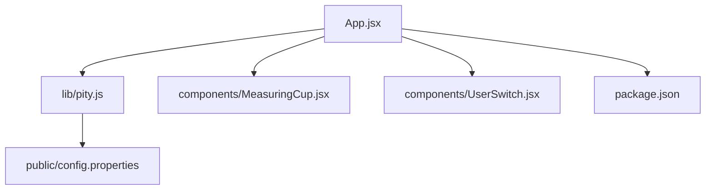
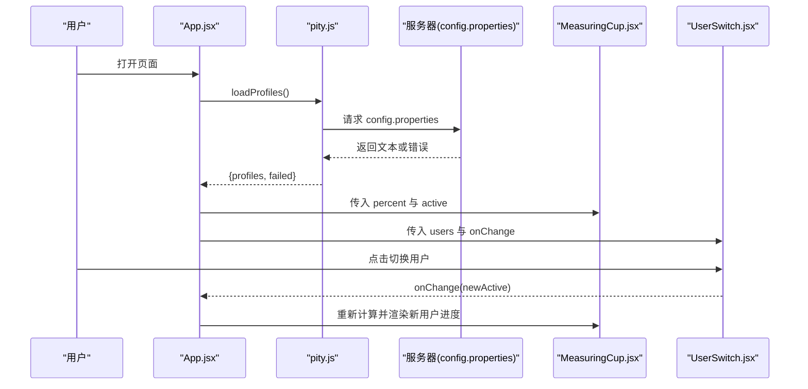
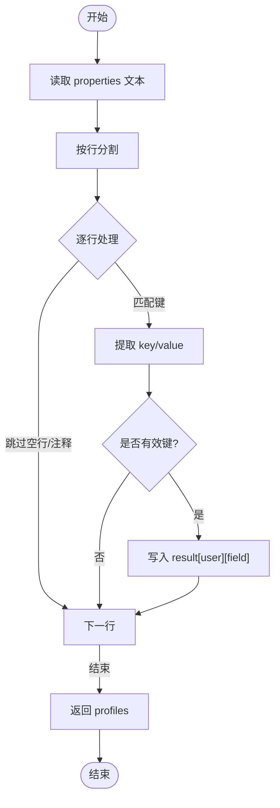
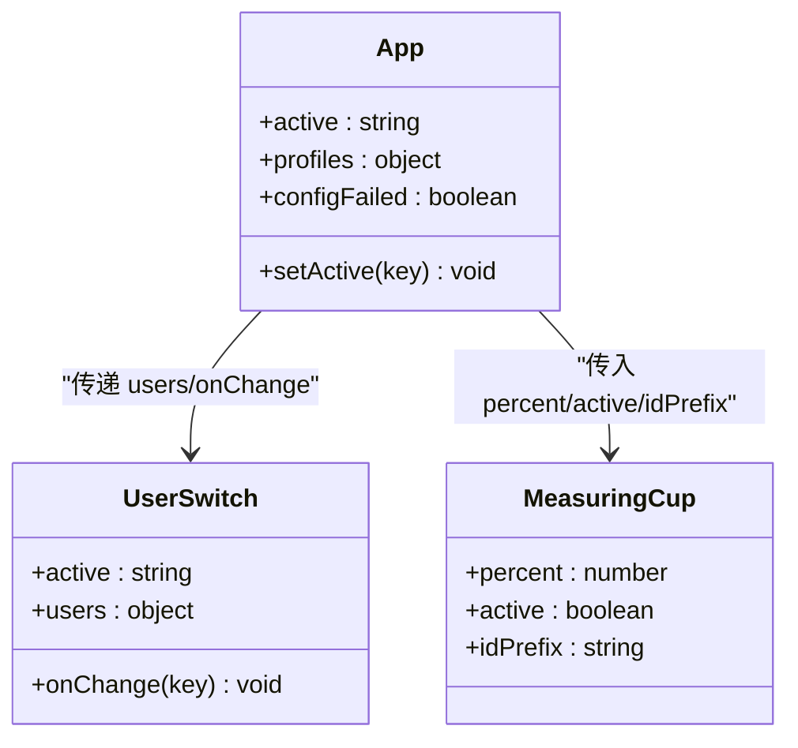
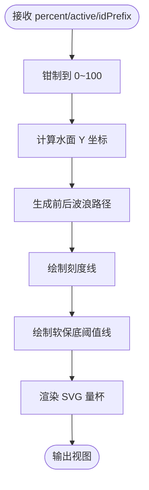
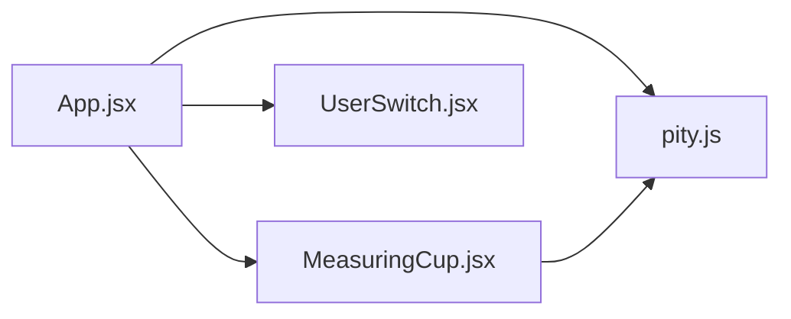

# 核心功能

<cite>
**本文引用的文件**
- [src/lib/pity.js](file://src/lib/pity.js)
- [public/config.properties](file://public/config.properties)
- [src/App.jsx](file://src/App.jsx)
- [src/components/MeasuringCup.jsx](file://src/components/MeasuringCup.jsx)
- [src/components/UserSwitch.jsx](file://src/components/UserSwitch.jsx)
- [package.json](file://package.json)
</cite>

## 目录
1. [简介](#简介)
2. [项目结构](#项目结构)
3. [核心组件](#核心组件)
4. [架构总览](#架构总览)
5. [详细组件分析](#详细组件分析)
6. [依赖关系分析](#依赖关系分析)
7. [性能考量](#性能考量)
8. [故障排查指南](#故障排查指南)
9. [结论](#结论)
10. [附录：使用示例与最佳实践](#附录使用示例与最佳实践)

## 简介
本项目是一个基于 React + Vite 的“五星角色获取进度”可视化应用，核心围绕保底计算引擎、配置管理系统和用户管理系统展开。通过读取外部配置文件，将纠缠之缘与原石折算为百分比进度，并在量杯图形中直观展示；同时支持在 userA 与 userB 两个用户之间切换查看各自进度。

本文件面向初学者提供循序渐进的解释，也为有经验的开发者提供实现细节、算法说明与优化建议。

## 项目结构
- 入口与页面编排：App.jsx
- 核心逻辑库：pity.js（保底计算、配置解析、默认回退）
- UI 组件：MeasuringCup.jsx（量杯可视化）、UserSwitch.jsx（用户切换）
- 静态配置：config.properties（用户初始数据）
- 构建与运行：package.json（Vite 脚本与依赖）

图表来源
- [src/App.jsx:1-109](file://src/App.jsx#L1-L109)
- [src/lib/pity.js:1-73](file://src/lib/pity.js#L1-L73)
- [public/config.properties:1-21](file://public/config.properties#L1-L21)
- [package.json:1-20](file://package.json#L1-L20)

章节来源
- [src/App.jsx:1-109](file://src/App.jsx#L1-L109)
- [package.json:1-20](file://package.json#L1-L20)

## 核心组件
- 保底计算引擎（pity.js）
  - 常量定义：单次抽卡成本、一次保底所需原石、软保底阈值
  - 百分比计算：将“已消耗纠缠之缘 × 单抽成本 + 剩余原石”折算为百分比，保留两位小数
  - 配置解析：读取 properties 文本，仅识别 userA/userB 前缀的键，支持 fates、primogems、name
  - 默认回退：当远程配置不可用时，返回内置兜底数据
- 用户管理系统（App.jsx + UserSwitch.jsx）
  - 维护当前激活用户 active 与 profiles 数据
  - 渲染量杯面板与切换按钮，支持多用户视图切换
- 可视化组件（MeasuringCup.jsx）
  - 根据百分比绘制量杯水位、刻度线与软保底阈值线
  - 在达到或超过软保底阈值时高亮显示

章节来源
- [src/lib/pity.js:1-73](file://src/lib/pity.js#L1-L73)
- [src/App.jsx:1-109](file://src/App.jsx#L1-L109)
- [src/components/UserSwitch.jsx:1-22](file://src/components/UserSwitch.jsx#L1-L22)
- [src/components/MeasuringCup.jsx:1-109](file://src/components/MeasuringCup.jsx#L1-L109)

## 架构总览
应用启动后，App 组件异步加载配置并渲染界面；pity.js 负责计算与解析；MeasuringCup 负责可视化；UserSwitch 负责用户切换。

图表来源
- [src/App.jsx:13-23](file://src/App.jsx#L13-L23)
- [src/lib/pity.js:62-72](file://src/lib/pity.js#L62-L72)
- [src/components/MeasuringCup.jsx:17-42](file://src/components/MeasuringCup.jsx#L17-L42)
- [src/components/UserSwitch.jsx:3-21](file://src/components/UserSwitch.jsx#L3-L21)

## 详细组件分析

### 保底计算引擎（pity.js）
- 关键常量
  - 单次抽卡成本：固定值（用于将纠缠之缘折算为原石）
  - 一次保底所需原石：固定值（作为 100% 基准）
  - 软保底阈值：百分比阈值，超过该值后视为进入软保底区间
- 百分比计算算法
  - 输入：fates（已消耗纠缠之缘数量）、primogems（剩余原石）
  - 公式：((fates × 单抽成本 + primogems) / 保底所需原石) × 100
  - 精度控制：结果乘以 100 后取整再除以 100，确保保留两位小数
- 配置解析逻辑
  - 按行读取 properties 文本，忽略空行、注释行（以 # 开头）和特殊行（以 ! 开头）
  - 仅接受形如 userA.fates、userA.primogems、userA.name 等键
  - 数值字段进行非负校验，名称字段直接赋值
- 默认回退机制
  - 网络请求失败或响应异常时，返回内置的兜底用户数据，保证界面可用

图表来源
- [src/lib/pity.js:31-59](file://src/lib/pity.js#L31-L59)

章节来源
- [src/lib/pity.js:1-73](file://src/lib/pity.js#L1-L73)

### 配置管理系统（config.properties）
- 文件格式规范
  - 每行一条键值对，支持空格分隔
  - 以 # 开头的行为注释
  - 支持的键：userA/userB 前缀的 fates、primogems、name
- 解析与回退
  - 应用启动时通过 fetch 拉取配置，失败则使用内置兜底数据
  - 解析器严格校验键名与数值范围，避免脏数据影响计算
- 典型内容
  - 包含两个用户的初始 fates、primogems 与可选 name

章节来源
- [public/config.properties:1-21](file://public/config.properties#L1-L21)
- [src/lib/pity.js:62-72](file://src/lib/pity.js#L62-L72)

### 用户管理系统（App.jsx + UserSwitch.jsx）
- 状态管理
  - active：当前激活的用户标识（'userA' | 'userB'）
  - profiles：从配置加载的用户数据对象
  - configFailed：标记配置加载是否失败
- 切换逻辑
  - UserSwitch 渲染两个按钮，点击时调用 onChange 更新 active
  - App 根据 active 计算偏移量，滑动展示对应用户的量杯面板
- 数据模型
  - 每个用户包含 name、fates、primogems 三个字段
  - 通过 calcPercent 计算百分比并传递给 MeasuringCup

图表来源
- [src/App.jsx:8-104](file://src/App.jsx#L8-L104)
- [src/components/UserSwitch.jsx:3-21](file://src/components/UserSwitch.jsx#L3-L21)
- [src/components/MeasuringCup.jsx:17-42](file://src/components/MeasuringCup.jsx#L17-L42)

章节来源
- [src/App.jsx:8-104](file://src/App.jsx#L8-L104)
- [src/components/UserSwitch.jsx:1-22](file://src/components/UserSwitch.jsx#L1-L22)

### 可视化组件（MeasuringCup.jsx）
- 水位绘制
  - 根据百分比计算水面高度，生成前后两层波浪路径
- 刻度与阈值线
  - 绘制 25%、50%、75% 刻度线
  - 绘制软保底阈值虚线，并在达到阈值时高亮
- 可访问性
  - SVG 添加 aria-label，便于屏幕阅读器朗读当前百分比

图表来源
- [src/components/MeasuringCup.jsx:17-105](file://src/components/MeasuringCup.jsx#L17-L105)

章节来源
- [src/components/MeasuringCup.jsx:1-109](file://src/components/MeasuringCup.jsx#L1-L109)

## 依赖关系分析
- App.jsx 依赖 pity.js 提供的 loadProfiles、calcPercent、BOOST_THRESHOLD
- MeasuringCup.jsx 依赖 BOOST_THRESHOLD 用于阈值线渲染
- UserSwitch.jsx 无外部依赖，仅依赖父组件传入的数据与回调
- 所有模块通过 ES Module 方式组织，Vite 负责打包与开发服务器

图表来源
- [src/App.jsx:1-4](file://src/App.jsx#L1-L4)
- [src/components/MeasuringCup.jsx:1-2](file://src/components/MeasuringCup.jsx#L1-L2)

章节来源
- [src/App.jsx:1-109](file://src/App.jsx#L1-L109)
- [src/components/MeasuringCup.jsx:1-109](file://src/components/MeasuringCup.jsx#L1-L109)
- [src/components/UserSwitch.jsx:1-22](file://src/components/UserSwitch.jsx#L1-L22)

## 性能考量
- 计算复杂度
  - calcPercent 为 O(1)，适合高频调用
- 渲染优化
  - MeasuringCup 使用 useMemo 缓存波浪路径，减少重复计算
  - 量杯 SVG 元素数量有限，动画与渐变开销较低
- 网络请求
  - 配置拉取设置 no-store 缓存策略，避免旧数据干扰
  - 失败时立即回退至内置数据，提升可用性
- 可扩展性
  - 若未来增加更多用户，可在 ORDER 数组中扩展，无需改动核心逻辑

[本节为通用性能讨论，不直接分析具体代码片段]

## 故障排查指南
- 配置文件无法加载
  - 现象：页面提示“配置文件读取失败，当前使用内置兜底数据”
  - 原因：网络错误或 HTTP 状态非 2xx
  - 处理：检查部署路径与 BASE_URL，确认 public/config.properties 可访问
  - 参考位置：[src/lib/pity.js:62-72](file://src/lib/pity.js#L62-L72)、[src/App.jsx:51-53](file://src/App.jsx#L51-L53)
- 配置格式错误
  - 现象：某些字段未生效或数值异常
  - 原因：键名不符合 userX.field 格式，或数值为负数
  - 处理：修正 properties 文件中的键名与数值范围
  - 参考位置：[src/lib/pity.js:37-58](file://src/lib/pity.js#L37-L58)
- 百分比显示异常
  - 现象：百分比超出 0~100 或小数位不正确
  - 原因：输入为负数或未进行精度处理
  - 处理：确保传入非负数值，并使用 calcPercent 进行标准化
  - 参考位置：[src/lib/pity.js:22-25](file://src/lib/pity.js#L22-L25)
- 软保底阈值线不显示
  - 现象：阈值线未出现或样式不对
  - 原因：百分比未正确传入或阈值常量未引入
  - 处理：确认 MeasuringCup 接收到正确的 percent，且引入了 BOOST_THRESHOLD
  - 参考位置：[src/components/MeasuringCup.jsx:37-92](file://src/components/MeasuringCup.jsx#L37-L92)

章节来源
- [src/lib/pity.js:22-72](file://src/lib/pity.js#L22-L72)
- [src/App.jsx:51-53](file://src/App.jsx#L51-L53)
- [src/components/MeasuringCup.jsx:37-92](file://src/components/MeasuringCup.jsx#L37-L92)

## 结论
本项目的核心由保底计算引擎、配置管理与用户管理三部分组成，职责清晰、耦合度低。通过严格的配置解析与默认回退机制，保证了应用的健壮性；通过精确的百分比计算与可视化呈现，提供了直观的用户体验。对于初学者，可按“配置 → 计算 → 渲染”的顺序理解；对于进阶开发者，可在此基础上扩展更多用户、自定义阈值或接入后端服务。

[本节为总结性内容，不直接分析具体代码片段]

## 附录：使用示例与最佳实践
- 如何修改用户初始数据
  - 编辑 public/config.properties，调整 userA 与 userB 的 fates、primogems 与 name
  - 保存后刷新页面即可看到变化
  - 参考位置：[public/config.properties:12-20](file://public/config.properties#L12-L20)
- 如何在代码中使用保底计算
  - 导入 calcPercent 与常量，传入 fates 与 primogems 得到百分比
  - 将百分比传递给 MeasuringCup 进行渲染
  - 参考位置：[src/App.jsx:70-72](file://src/App.jsx#L70-L72)、[src/lib/pity.js:22-25](file://src/lib/pity.js#L22-L25)
- 如何切换用户
  - 点击 UserSwitch 中的按钮触发 onChange，更新 active
  - App 根据 active 计算偏移并切换量杯面板
  - 参考位置：[src/components/UserSwitch.jsx:7-18](file://src/components/UserSwitch.jsx#L7-L18)、[src/App.jsx:68-104](file://src/App.jsx#L68-L104)
- 集成其他组件的建议
  - 新增用户：在 ORDER 数组中添加新键，并在配置文件中提供对应数据
  - 新增指标：在 App 中计算并透传给 MeasuringCup，或在 MeasuringCup 中扩展显示逻辑
  - 统一常量：将阈值与成本等常量集中在 pity.js，便于全局维护

[本节为使用指导，不直接分析具体代码片段]