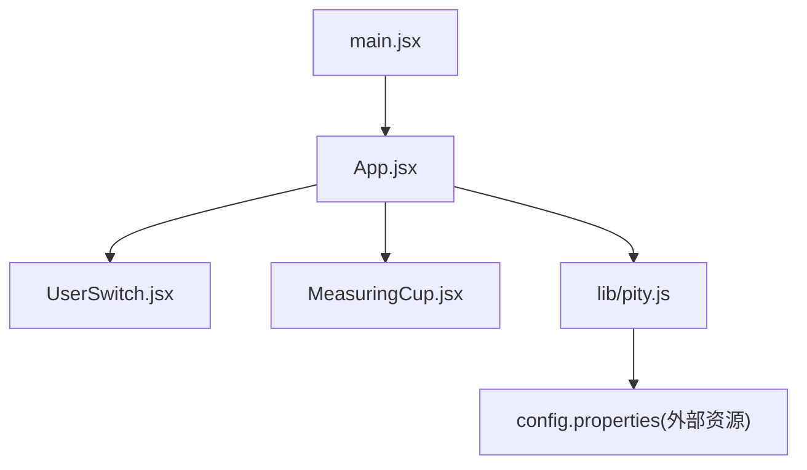
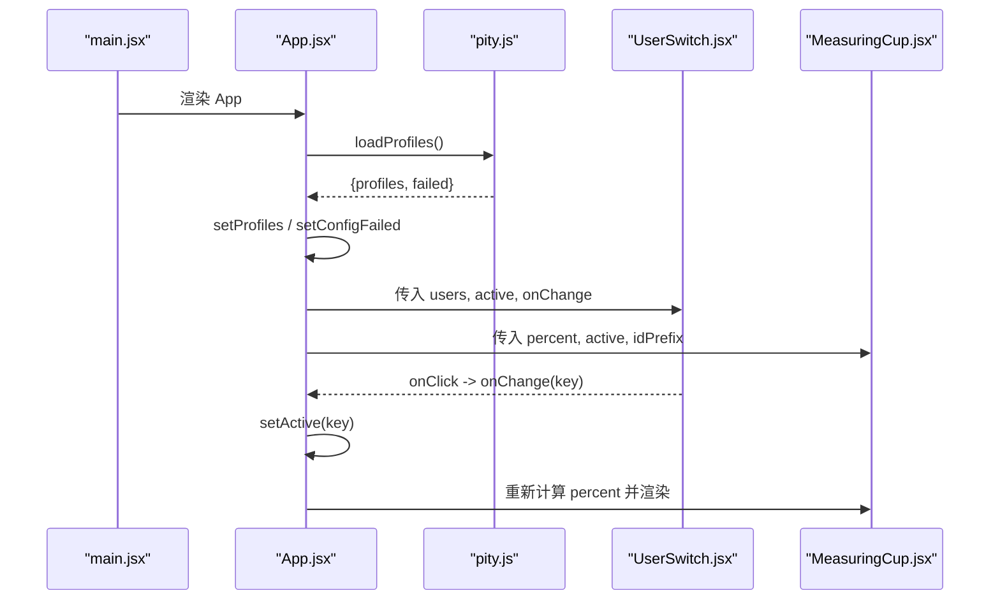
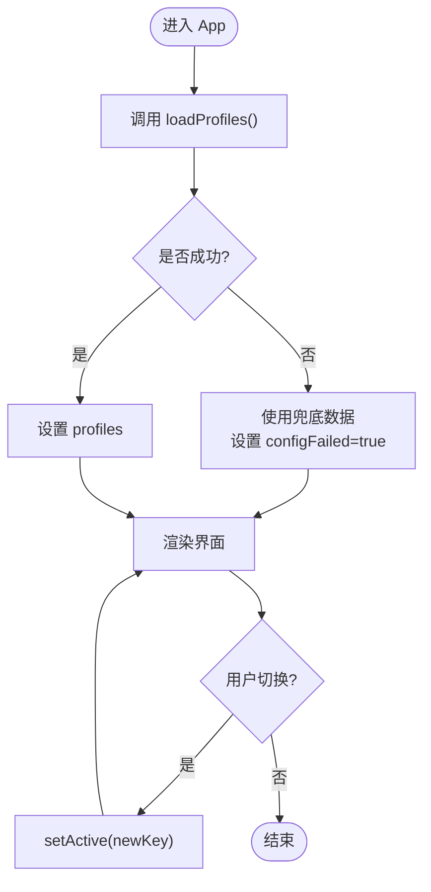
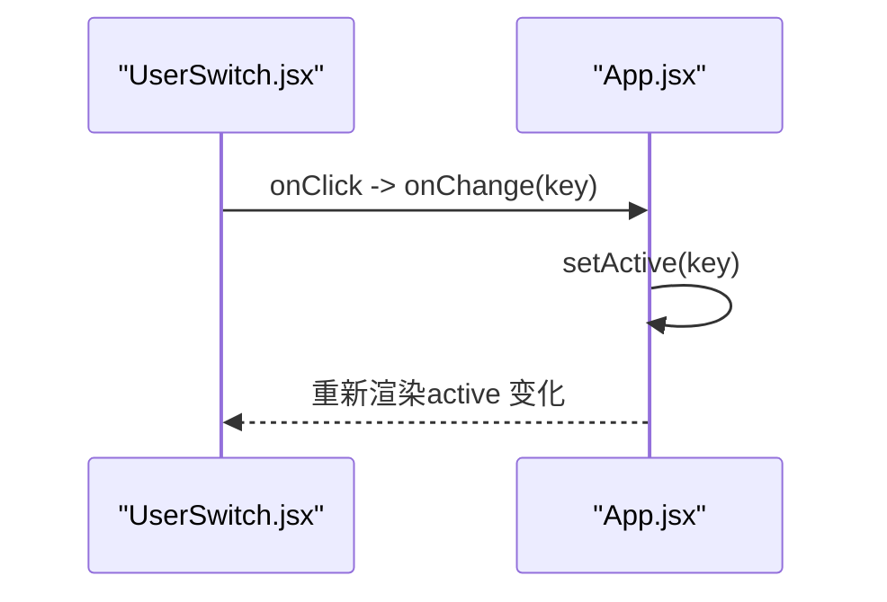
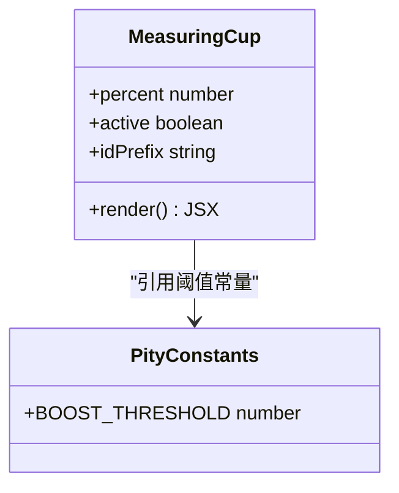
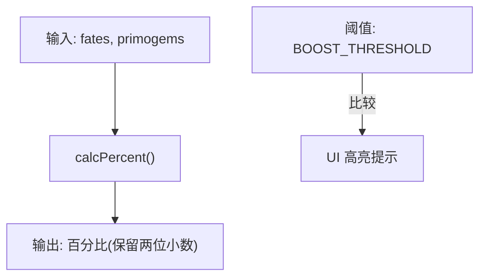
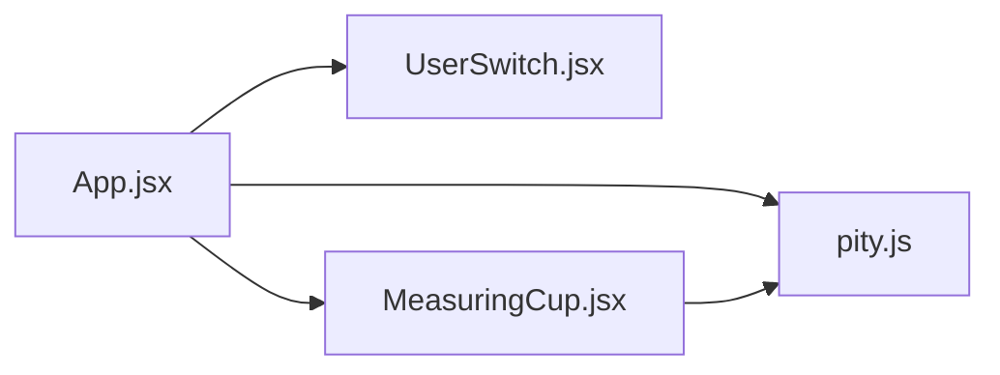

# 用户管理系统

<cite>
**本文引用的文件**
- [src/App.jsx](file://src/App.jsx)
- [src/components/UserSwitch.jsx](file://src/components/UserSwitch.jsx)
- [src/components/MeasuringCup.jsx](file://src/components/MeasuringCup.jsx)
- [src/lib/pity.js](file://src/lib/pity.js)
- [src/main.jsx](file://src/main.jsx)
- [package.json](file://package.json)
</cite>

## 目录
1. [简介](#简介)
2. [项目结构](#项目结构)
3. [核心组件与数据模型](#核心组件与数据模型)
4. [架构总览](#架构总览)
5. [详细组件分析](#详细组件分析)
6. [依赖关系分析](#依赖关系分析)
7. [性能考量](#性能考量)
8. [故障排查指南](#故障排查指南)
9. [结论](#结论)
10. [附录：配置与字段约束](#附录：配置与字段约束)

## 简介
本系统是一个面向“五星角色获取进度”的可视化应用，支持在两个用户（userA、userB）之间切换查看各自的保底进度。系统从配置文件读取用户数据，计算当前进度百分比，并通过量杯可视化呈现；同时提供用户切换交互，确保状态同步与渲染一致性。

## 项目结构
- 入口与根组件
  - main.jsx：React 应用挂载点，渲染 App 组件。
  - App.jsx：应用主逻辑，负责数据加载、状态管理、用户切换与页面渲染。
- 业务逻辑库
  - lib/pity.js：保底计算、配置解析与加载、兜底数据等核心逻辑。
- UI 组件
  - components/UserSwitch.jsx：用户切换按钮组。
  - components/MeasuringCup.jsx：量杯可视化组件，展示当前用户的保底进度。
- 构建与依赖
  - package.json：声明 React 与 Vite 相关依赖及脚本命令。

图表来源
- [src/main.jsx:1-11](file://src/main.jsx#L1-L11)
- [src/App.jsx:1-109](file://src/App.jsx#L1-L109)
- [src/components/UserSwitch.jsx:1-22](file://src/components/UserSwitch.jsx#L1-L22)
- [src/components/MeasuringCup.jsx:1-109](file://src/components/MeasuringCup.jsx#L1-L109)
- [src/lib/pity.js:1-73](file://src/lib/pity.js#L1-L73)

章节来源
- [src/main.jsx:1-11](file://src/main.jsx#L1-L11)
- [package.json:1-20](file://package.json#L1-L20)

## 核心组件与数据模型
- 用户数据模型（userA、userB）
  - name：用户显示名称，字符串类型，来自配置文件中的 {user}.name。
  - fates：已消耗的纠缠之缘数量，非负整数，来自配置文件中的 {user}.fates。
  - primogems：剩余原石数量，非负整数，来自配置文件中的 {user}.primogems。
- 数据源与校验
  - 通过解析配置文件（key=value 或 key:value），仅识别 userA/userB 前缀的键，并过滤非法行与无效值。
  - 若解析失败或网络请求异常，则回退到内置兜底数据，保证可用性。
- 进度计算
  - 将 fates 与 primogems 统一折算为原石单位后，除以单次保底所需原石总量，得到百分比。
  - 超过软保底阈值时，UI 会高亮提示。

章节来源
- [src/lib/pity.js:10-14](file://src/lib/pity.js#L10-L14)
- [src/lib/pity.js:22-25](file://src/lib/pity.js#L22-L25)
- [src/lib/pity.js:31-59](file://src/lib/pity.js#L31-L59)
- [src/lib/pity.js:62-72](file://src/lib/pity.js#L62-L72)

## 架构总览
应用采用单向数据流：
- 数据层：pity.js 负责拉取并解析配置，返回 profiles（包含 userA、userB 的数据）。
- 状态层：App 使用 useState 维护 active 用户、profiles 数据以及配置加载失败标志。
- 视图层：根据 active 用户渲染 MeasuringCup 与 UserSwitch，并在切换时更新 UI。

图表来源
- [src/App.jsx:13-23](file://src/App.jsx#L13-L23)
- [src/App.jsx:68-104](file://src/App.jsx#L68-L104)
- [src/components/UserSwitch.jsx:7-17](file://src/components/UserSwitch.jsx#L7-L17)
- [src/lib/pity.js:62-72](file://src/lib/pity.js#L62-L72)

## 详细组件分析

### App 组件：用户协调与状态同步
- 职责
  - 初始化 active 用户（默认 userA）。
  - 异步加载 profiles，处理成功与失败分支。
  - 根据 active 用户计算进度百分比，并渲染量杯与切换控件。
- 状态管理
  - active：当前激活的用户键（'userA' | 'userB'）。
  - profiles：用户数据对象，包含 userA 与 userB。
  - configFailed：配置加载失败标志，用于提示使用兜底数据。
- 数据获取与错误处理
  - 使用 useEffect 发起 loadProfiles，设置 mounted 标志避免卸载后更新。
  - 失败时启用兜底数据并标记 configFailed，向用户提示。
- 渲染逻辑
  - 使用 ORDER 数组控制渲染顺序与滑动偏移。
  - 对每个用户计算 percent，并传递给 MeasuringCup。
  - 将 active 与 onChange 传递给 UserSwitch，实现双向联动。

图表来源
- [src/App.jsx:13-23](file://src/App.jsx#L13-L23)
- [src/App.jsx:36-104](file://src/App.jsx#L36-L104)

章节来源
- [src/App.jsx:1-109](file://src/App.jsx#L1-L109)

### UserSwitch 组件：用户切换逻辑与事件处理
- 职责
  - 渲染用户切换按钮列表，显示对应用户的 name。
  - 监听点击事件，调用父组件传入的 onChange 更新 active。
  - 通过 aria 属性提供无障碍支持。
- 交互流程
  - 点击某个用户按钮 -> 触发 onClick -> 调用 onChange(key) -> App 更新 active -> 触发重渲染。
- UI 状态管理
  - 通过 active === key 判断当前选中态，动态添加样式类名。
  - 使用 data-pos 辅助定位滑块位置（由父级样式控制）。

图表来源
- [src/components/UserSwitch.jsx:7-17](file://src/components/UserSwitch.jsx#L7-L17)
- [src/App.jsx:104](file://src/App.jsx#L104)

章节来源
- [src/components/UserSwitch.jsx:1-22](file://src/components/UserSwitch.jsx#L1-L22)
- [src/App.jsx:104](file://src/App.jsx#L104)

### MeasuringCup 组件：可视化与阈值提示
- 职责
  - 根据 percent 计算水位高度，绘制前后波浪路径。
  - 标注软保底阈值线，当达到阈值时高亮提示。
  - 生成唯一 ID 前缀以避免重复 SVG 标识冲突。
- 性能优化
  - 使用 useMemo 缓存波浪路径计算，减少重复渲染开销。
  - 限制 percent 范围在 0-100，防止越界。
- 视觉反馈
  - 根据 active 切换水波动画状态。
  - 当 percent >= BOOST_THRESHOLD 时，阈值线高亮。

图表来源
- [src/components/MeasuringCup.jsx:17-109](file://src/components/MeasuringCup.jsx#L17-L109)
- [src/lib/pity.js:7-8](file://src/lib/pity.js#L7-L8)

章节来源
- [src/components/MeasuringCup.jsx:1-109](file://src/components/MeasuringCup.jsx#L1-L109)
- [src/lib/pity.js:7-8](file://src/lib/pity.js#L7-L8)

### 保底计算引擎集成
- 计算函数
  - calcPercent(fates, primogems)：将纠缠之缘与原石统一折算为原石单位，再除以保底成本，得到百分比。
- 阈值常量
  - BOOST_THRESHOLD：软保底起点百分比，用于 UI 高亮提示。
- 配置解析
  - parseProfiles(text)：逐行解析 properties 文本，仅接受 userA/userB 前缀的合法键，并对数值进行非负校验。
- 数据加载
  - loadProfiles()：尝试从 BASE_URL/config.properties 拉取配置，失败时返回兜底数据并标记 failed。

图表来源
- [src/lib/pity.js:22-25](file://src/lib/pity.js#L22-L25)
- [src/lib/pity.js:7-8](file://src/lib/pity.js#L7-L8)

章节来源
- [src/lib/pity.js:22-25](file://src/lib/pity.js#L22-L25)
- [src/lib/pity.js:7-8](file://src/lib/pity.js#L7-L8)

## 依赖关系分析
- 模块耦合
  - App.jsx 依赖 pity.js 的数据加载与计算能力，依赖 UserSwitch 与 MeasuringCup 进行 UI 渲染。
  - UserSwitch 与 MeasuringCup 均为无状态或弱状态组件，通过 props 接收数据与回调，保持低耦合。
- 外部依赖
  - React 与 ReactDOM：提供组件化与渲染能力。
  - Vite：开发与构建工具链。
- 潜在循环依赖
  - 当前结构清晰，未发现循环依赖。

图表来源
- [src/App.jsx:1-109](file://src/App.jsx#L1-L109)
- [src/components/UserSwitch.jsx:1-22](file://src/components/UserSwitch.jsx#L1-L22)
- [src/components/MeasuringCup.jsx:1-109](file://src/components/MeasuringCup.jsx#L1-L109)
- [src/lib/pity.js:1-73](file://src/lib/pity.js#L1-L73)

章节来源
- [package.json:11-18](file://package.json#L11-L18)

## 性能考量
- 计算缓存
  - MeasuringCup 使用 useMemo 缓存波浪路径，避免每次渲染重复计算。
- 渲染优化
  - App 中通过 ORDER 数组与 transform 滑动实现多面板切换，减少 DOM 重建。
- 网络请求
  - loadProfiles 使用 no-store 缓存策略，确保配置变更即时生效；失败时快速回退至兜底数据，提升鲁棒性。
- 阈值高亮
  - 仅在 percent >= BOOST_THRESHOLD 时改变样式，降低不必要的重绘。

[本节为通用性能建议，不直接分析具体代码文件]

## 故障排查指南
- 配置加载失败
  - 现象：页面顶部出现“配置文件读取失败，当前使用内置兜底数据”的提示。
  - 原因：网络错误或 HTTP 响应非 ok。
  - 处理：检查 BASE_URL 与 config.properties 是否存在且可访问；确认服务器返回码。
- 数据格式错误
  - 现象：某些字段未生效或被忽略。
  - 原因：配置文件行不符合 {user}.{field} 格式，或数值为非负数。
  - 处理：修正键名与值格式，确保 fates/primogems 为非负整数，name 可为空字符串。
- 用户切换无响应
  - 现象：点击切换按钮后界面不变。
  - 原因：onChange 未正确传递或 active 状态未更新。
  - 处理：检查 UserSwitch 的 onClick 是否调用 onChange(key)，App 是否正确设置 active。

章节来源
- [src/App.jsx:51-53](file://src/App.jsx#L51-L53)
- [src/lib/pity.js:62-72](file://src/lib/pity.js#L62-L72)
- [src/lib/pity.js:37-55](file://src/lib/pity.js#L37-L55)

## 结论
本系统以简洁的单向数据流实现了双用户保底进度的可视化与切换。通过 pity.js 提供稳定的数据解析与计算能力，App 负责状态协调，UserSwitch 与 MeasuringCup 分别承担交互与展示职责。系统在错误处理、性能优化与用户体验方面均有良好实践，适合进一步扩展更多用户与更丰富的可视化功能。

[本节为总结性内容，不直接分析具体代码文件]

## 附录：配置与字段约束
- 配置文件格式
  - 每行一个键值对，支持 = 或 : 分隔。
  - 仅识别 userA/userB 前缀的键：{user}.fates、{user}.primogems、{user}.name。
  - 注释行以 # 或 ! 开头将被忽略。
- 字段约束
  - name：字符串，允许为空（为空时使用默认名称）。
  - fates：非负整数，表示已消耗的纠缠之缘数量。
  - primogems：非负整数，表示剩余原石数量。
- 兜底数据
  - 当配置加载失败或解析异常时，系统将回退到内置兜底数据，确保应用可用。

章节来源
- [src/lib/pity.js:10-14](file://src/lib/pity.js#L10-L14)
- [src/lib/pity.js:31-59](file://src/lib/pity.js#L31-L59)
- [src/lib/pity.js:62-72](file://src/lib/pity.js#L62-L72)