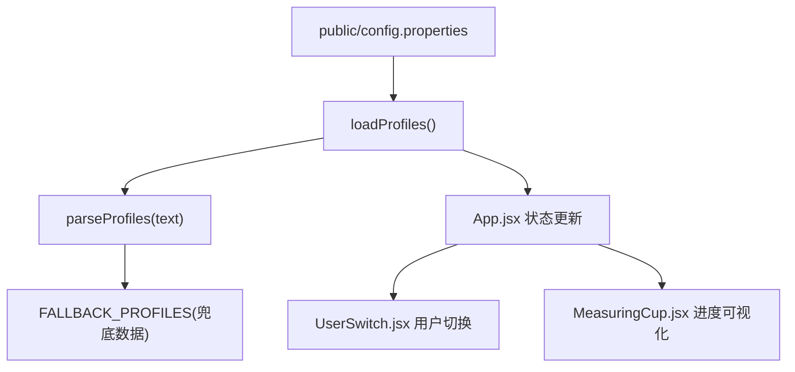
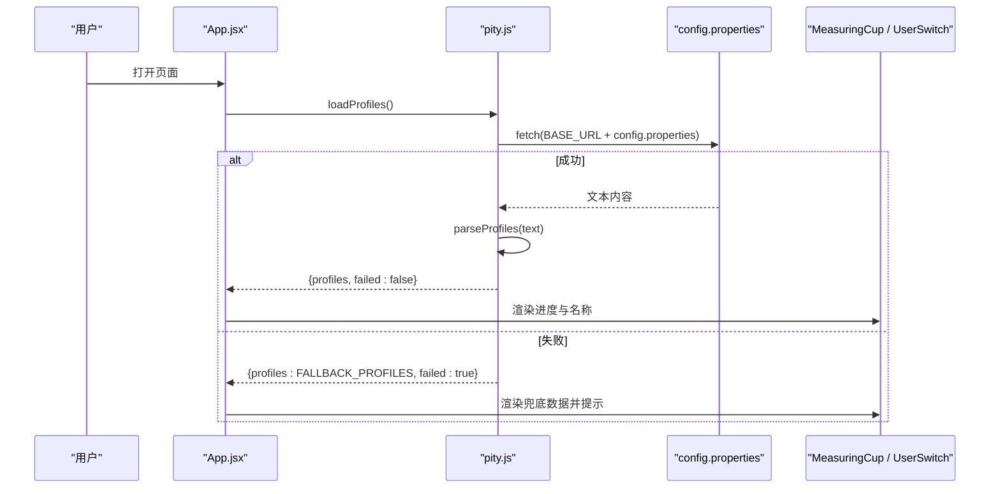
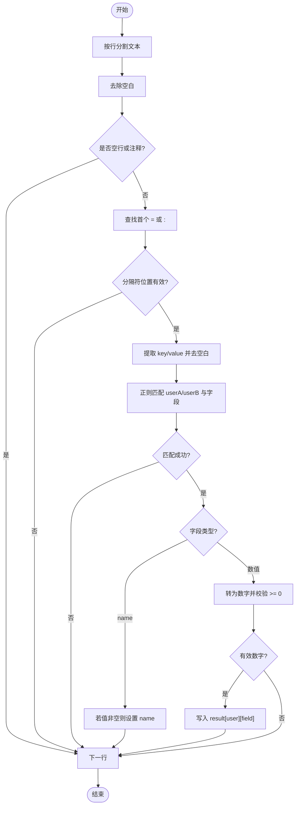
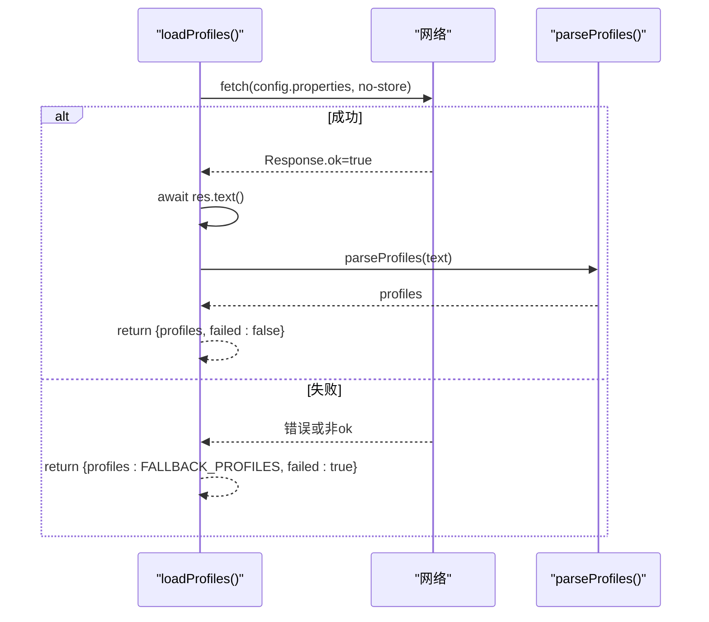
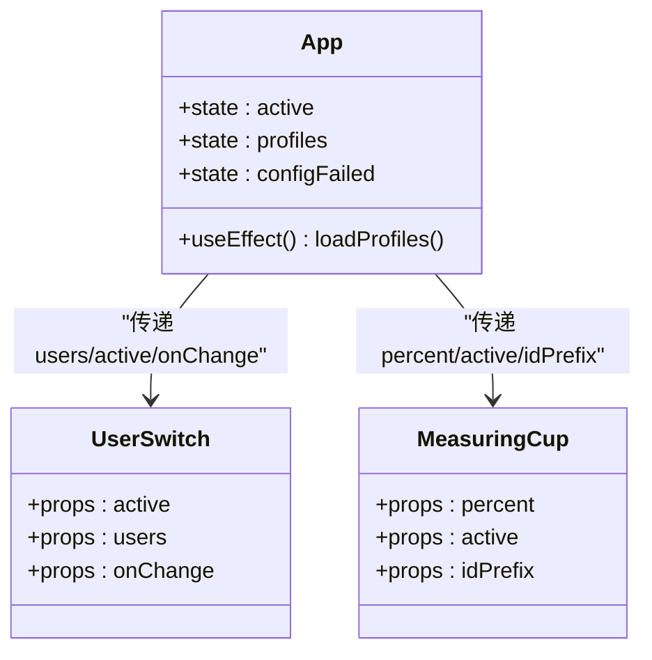
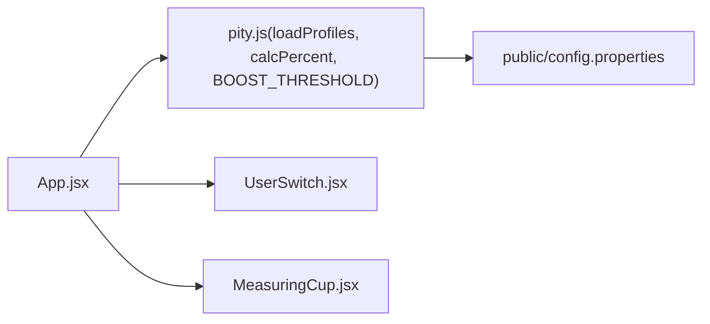

# 配置管理系统

<cite>
**本文引用的文件**
- [public/config.properties](file://public/config.properties)
- [src/lib/pity.js](file://src/lib/pity.js)
- [src/App.jsx](file://src/App.jsx)
- [src/components/MeasuringCup.jsx](file://src/components/MeasuringCup.jsx)
- [src/components/UserSwitch.jsx](file://src/components/UserSwitch.jsx)
- [src/main.jsx](file://src/main.jsx)
</cite>

## 目录
1. [简介](#简介)
2. [项目结构](#项目结构)
3. [核心组件](#核心组件)
4. [架构总览](#架构总览)
5. [详细组件分析](#详细组件分析)
6. [依赖关系分析](#依赖关系分析)
7. [性能考虑](#性能考虑)
8. [故障排查指南](#故障排查指南)
9. [结论](#结论)
10. [附录：配置文件编写示例与常见错误](#附录：配置文件编写示例与常见错误)

## 简介
本配置管理系统用于管理“五星角色获取进度”的配置文件，支持多用户（userA、userB）的保底进度数据。系统通过读取 properties 格式的配置文件，解析键值对并计算当前进度百分比；当网络或文件不可用时，自动回退到内置默认数据，确保应用可用。

## 项目结构
- 配置文件位于 public 目录下，构建后由静态资源服务器提供。
- 核心解析与加载逻辑集中在 src/lib/pity.js。
- React 入口在 src/main.jsx，主界面在 src/App.jsx，并通过子组件展示可视化进度与用户切换。

图表来源
- [src/lib/pity.js:61-72](file://src/lib/pity.js#L61-L72)
- [src/App.jsx:13-23](file://src/App.jsx#L13-L23)
- [src/components/UserSwitch.jsx:1-22](file://src/components/UserSwitch.jsx#L1-L22)
- [src/components/MeasuringCup.jsx:17-42](file://src/components/MeasuringCup.jsx#L17-L42)

章节来源
- [src/main.jsx:1-11](file://src/main.jsx#L1-L11)
- [src/App.jsx:1-109](file://src/App.jsx#L1-L109)
- [src/lib/pity.js:1-73](file://src/lib/pity.js#L1-L73)
- [public/config.properties:1-21](file://public/config.properties#L1-L21)

## 核心组件
- 配置文件：public/config.properties，定义 userA 与 userB 的 fates、primogems、name。
- 解析器：parseProfiles(text)，按行解析 properties，过滤注释与非法行，提取合法键值对。
- 加载器：loadProfiles()，异步 fetch 配置文件，失败时返回兜底数据。
- 计算：calcPercent(fates, primogems)，将已消耗纠缠之缘与剩余原石折算为百分比。
- UI 集成：App.jsx 负责状态管理与渲染；UserSwitch.jsx 负责用户切换；MeasuringCup.jsx 负责可视化进度。

章节来源
- [src/lib/pity.js:10-73](file://src/lib/pity.js#L10-L73)
- [src/App.jsx:1-109](file://src/App.jsx#L1-L109)
- [src/components/UserSwitch.jsx:1-22](file://src/components/UserSwitch.jsx#L1-L22)
- [src/components/MeasuringCup.jsx:1-109](file://src/components/MeasuringCup.jsx#L1-L109)

## 架构总览
配置管理的整体流程如下：
- App 启动后调用 loadProfiles() 拉取配置文件。
- 成功时，使用 parseProfiles() 解析文本，生成 profiles 对象。
- 失败时，直接返回内置 FALLBACK_PROFILES，并在 UI 提示“使用内置兜底数据”。
- App 根据 profiles 计算每个用户的进度百分比，并传递给 MeasuringCup 进行可视化。
- UserSwitch 允许用户在 userA 与 userB 之间切换，显示对应 name。

图表来源
- [src/App.jsx:13-23](file://src/App.jsx#L13-L23)
- [src/lib/pity.js:61-72](file://src/lib/pity.js#L61-L72)
- [src/lib/pity.js:31-59](file://src/lib/pity.js#L31-L59)

## 详细组件分析

### 配置文件格式规范（properties）
- 每行一条键值对，支持等号或冒号分隔：key = value 或 key:value。
- 支持的键前缀与字段：
  - userA.fates、userA.primogems、userA.name
  - userB.fates、userB.primogems、userB.name
- 字段类型与验证规则：
  - fates、primogems：必须为非负数字；若解析失败或小于 0，则忽略该行。
  - name：字符串；为空时不覆盖默认名。
- 注释与空行：
  - 以 # 或 ! 开头的行为注释，将被跳过。
  - 空白行将被跳过。
- 其他键将被忽略。

章节来源
- [public/config.properties:1-21](file://public/config.properties#L1-L21)
- [src/lib/pity.js:37-56](file://src/lib/pity.js#L37-L56)

### parseProfiles 解析逻辑
- 行分割：按 \r?\n 分割文本，逐行处理。
- 清理与过滤：
  - 去除首尾空白。
  - 跳过空行、以 # 或 ! 开头的注释行。
- 键值对提取：
  - 查找第一个 = 或 : 的位置作为分隔点。
  - 左侧为 key，右侧为 value，均去除空白。
- 正则匹配：
  - key 必须匹配 ^(userA|userB).(fates|primogems|name)$。
  - 仅接受 userA/userB 前缀及指定字段。
- 字段赋值与验证：
  - name：若非空则覆盖。
  - fates/primogems：转为数字，需非 NaN 且 >= 0，否则忽略。
- 结果初始化：
  - 初始化为两个用户的兜底数据，再被配置文件覆盖。

图表来源
- [src/lib/pity.js:31-59](file://src/lib/pity.js#L31-L59)

章节来源
- [src/lib/pity.js:31-59](file://src/lib/pity.js#L31-L59)

### 默认数据回退机制（FALLBACK_PROFILES）
- 作用：当配置文件无法获取或解析失败时，保证应用仍能运行。
- 策略：
  - parseProfiles 内部以 FALLBACK_PROFILES 为初始值，随后用配置文件覆盖。
  - loadProfiles 捕获异常时直接返回 FALLBACK_PROFILES，并标记 failed 为 true。
- 影响：
  - UI 会显示“正在读取配置…”直到数据就绪。
  - 若 failed 为 true，会在头部提示“配置文件读取失败，当前使用内置兜底数据”。

章节来源
- [src/lib/pity.js:10-14](file://src/lib/pity.js#L10-L14)
- [src/lib/pity.js:31-59](file://src/lib/pity.js#L31-L59)
- [src/lib/pity.js:61-72](file://src/lib/pity.js#L61-L72)
- [src/App.jsx:13-23](file://src/App.jsx#L13-L23)
- [src/App.jsx:51-53](file://src/App.jsx#L51-L53)

### loadProfiles 异步加载流程与错误处理
- 请求：
  - 使用 fetch 拉取 BASE_URL + config.properties。
  - 禁用缓存（no-store），确保每次读取最新配置。
- 成功路径：
  - 检查响应 ok，若失败抛出错误。
  - 读取文本并调用 parseProfiles 解析。
  - 返回 { profiles, failed: false }。
- 失败路径：
  - 任何异常（网络错误、HTTP 非 2xx、解析异常）都会进入 catch。
  - 返回 { profiles: FALLBACK_PROFILES, failed: true }。

图表来源
- [src/lib/pity.js:61-72](file://src/lib/pity.js#L61-L72)
- [src/lib/pity.js:31-59](file://src/lib/pity.js#L31-L59)

章节来源
- [src/lib/pity.js:61-72](file://src/lib/pity.js#L61-L72)

### 与 React 组件的集成与数据流
- 数据流：
  - App 在 useEffect 中调用 loadProfiles，并将返回的 profiles 与 failed 标志存入 state。
  - 若未加载完成，显示“正在读取配置…”。
  - 加载完成后，遍历 ORDER（userA、userB），计算每个用户的 percent 并渲染。
  - UserSwitch 接收 users 数据，按钮文本为用户 name。
  - MeasuringCup 接收 percent 与 active 状态，绘制进度杯。
- 状态管理：
  - active：当前激活的用户（userA 或 userB）。
  - profiles：解析后的用户配置集合。
  - configFailed：配置文件加载失败的标志。

图表来源
- [src/App.jsx:8-109](file://src/App.jsx#L8-L109)
- [src/components/UserSwitch.jsx:1-22](file://src/components/UserSwitch.jsx#L1-L22)
- [src/components/MeasuringCup.jsx:17-42](file://src/components/MeasuringCup.jsx#L17-L42)

章节来源
- [src/App.jsx:1-109](file://src/App.jsx#L1-L109)
- [src/components/UserSwitch.jsx:1-22](file://src/components/UserSwitch.jsx#L1-L22)
- [src/components/MeasuringCup.jsx:1-109](file://src/components/MeasuringCup.jsx#L1-L109)

## 依赖关系分析
- App.jsx 依赖 pity.js 提供的 loadProfiles、calcPercent、BOOST_THRESHOLD。
- MeasuringCup.jsx 依赖 BOOST_THRESHOLD 用于阈值线渲染。
- UserSwitch.jsx 依赖 users 数据中的 name 字段。
- 配置文件 public/config.properties 是外部数据源，由 loadProfiles 拉取。

图表来源
- [src/App.jsx:1-109](file://src/App.jsx#L1-L109)
- [src/lib/pity.js:1-73](file://src/lib/pity.js#L1-L73)
- [src/components/UserSwitch.jsx:1-22](file://src/components/UserSwitch.jsx#L1-L22)
- [src/components/MeasuringCup.jsx:1-109](file://src/components/MeasuringCup.jsx#L1-L109)
- [public/config.properties:1-21](file://public/config.properties#L1-L21)

章节来源
- [src/App.jsx:1-109](file://src/App.jsx#L1-L109)
- [src/lib/pity.js:1-73](file://src/lib/pity.js#L1-L73)
- [src/components/UserSwitch.jsx:1-22](file://src/components/UserSwitch.jsx#L1-L22)
- [src/components/MeasuringCup.jsx:1-109](file://src/components/MeasuringCup.jsx#L1-L109)
- [public/config.properties:1-21](file://public/config.properties#L1-L21)

## 性能考虑
- 解析复杂度：parseProfiles 对每行进行常数时间操作，整体 O(n)。
- 网络请求：fetch 禁用缓存，避免旧配置干扰；建议在生产环境配合 CDN 或版本化文件名提升命中率。
- 渲染优化：MeasuringCup 使用 useMemo 计算波形路径，减少重复计算。
- 内存占用：profiles 对象较小，无显著内存压力。

[本节为通用指导，无需特定文件引用]

## 故障排查指南
- 配置文件无法访问：
  - 现象：页面顶部提示“配置文件读取失败，当前使用内置兜底数据”。
  - 原因：HTTP 非 2xx、网络错误、BASE_URL 配置不正确。
  - 处理：检查部署路径与 BASE_URL；确认 public/config.properties 可被静态服务器访问。
- 解析结果为空或异常：
  - 现象：用户名为默认 userA/userB，进度为兜底值。
  - 原因：键名不匹配、字段类型错误、值为负数。
  - 处理：确保键符合 userA/userB.(fates|primogems|name)；数值字段为非负数字；name 可为空但不会覆盖默认名。
- 注释与空行：
  - 以 # 或 ! 开头的行为注释，不会被解析；空行会被跳过。
- 调试建议：
  - 在浏览器开发者工具的网络面板查看 config.properties 的请求与响应。
  - 检查控制台是否有 fetch 或解析相关错误信息。

章节来源
- [src/lib/pity.js:61-72](file://src/lib/pity.js#L61-L72)
- [src/lib/pity.js:37-56](file://src/lib/pity.js#L37-L56)
- [src/App.jsx:51-53](file://src/App.jsx#L51-L53)

## 结论
该配置管理系统通过清晰的 properties 格式与严格的解析规则，实现了多用户保底进度的灵活配置与稳定回退。结合 React 组件的数据流管理，提供了良好的用户体验与可维护性。建议在发布前校验配置文件语法，并结合监控与日志快速定位问题。

[本节为总结，无需特定文件引用]

## 附录：配置文件编写示例与常见错误
- 示例（参考现有配置）：
  - 为 userA 设置 fates=6、primogems=400、name=HaoYanran。
  - 为 userB 设置 fates=11、primogems=0、name=HaoHan。
- 常见错误与解决方案：
  - 键名错误：如 userX.fates 或 userA.level，将被忽略。请确保键为 userA/userB 且字段为 fates/primogems/name。
  - 数值错误：fates/primogems 必须为非负数字；负数或非数字将被忽略。
  - 注释误用：以 # 或 ! 开头的行被视为注释，不会被解析。
  - 分隔符缺失：缺少 = 或 : 的行将被跳过。
  - 网络问题：确保 BASE_URL 指向正确的静态资源根路径，且 config.properties 可访问。

章节来源
- [public/config.properties:1-21](file://public/config.properties#L1-L21)
- [src/lib/pity.js:37-56](file://src/lib/pity.js#L37-L56)
- [src/lib/pity.js:61-72](file://src/lib/pity.js#L61-L72)