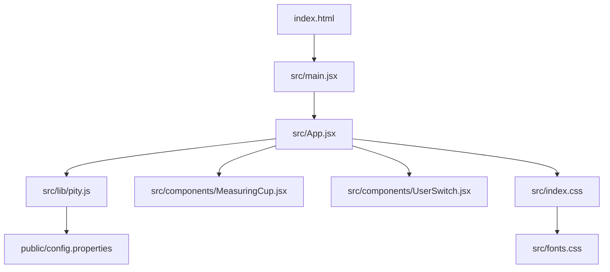
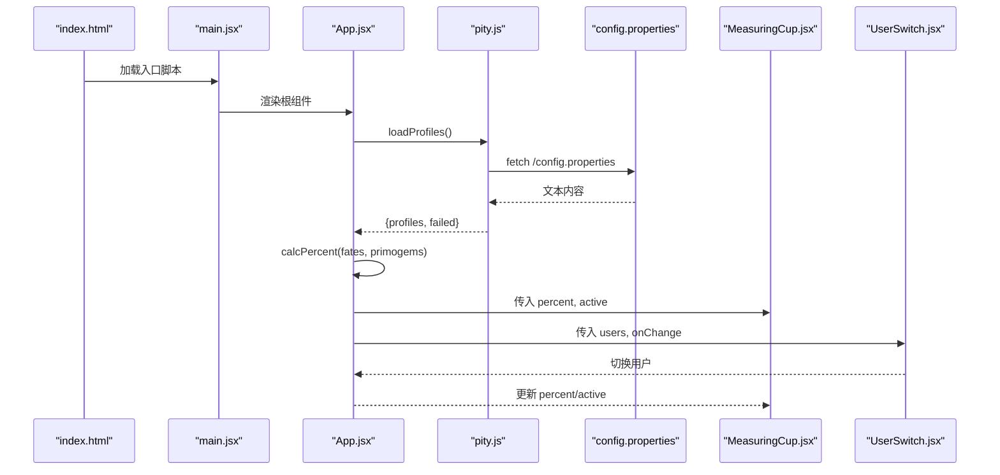
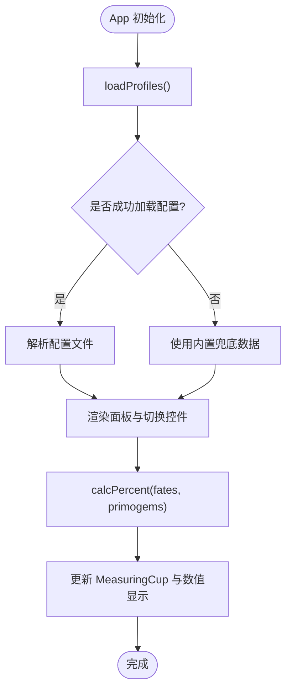
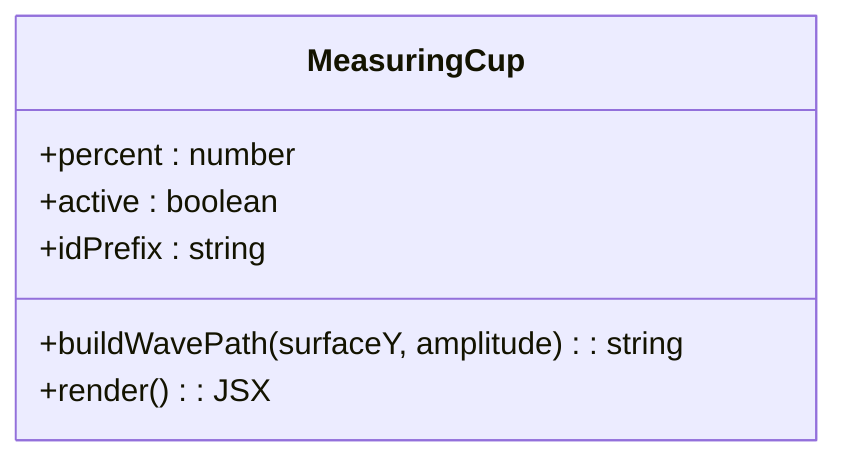
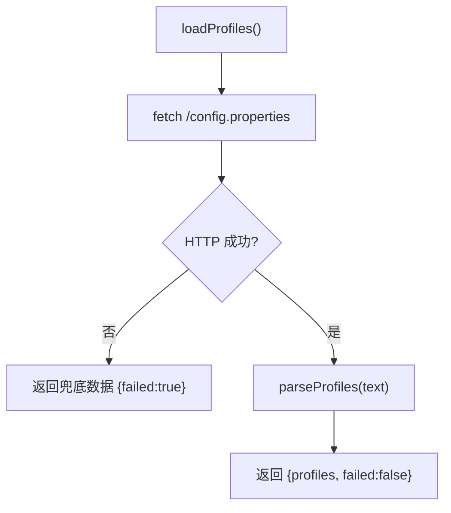
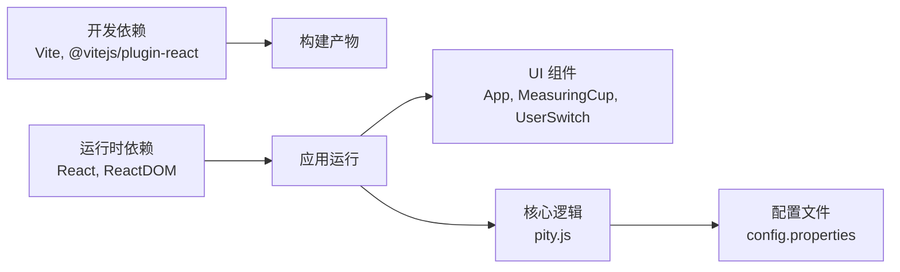

# 项目概述

<cite>
**本文引用的文件**
- [package.json](file://package.json)
- [vite.config.js](file://vite.config.js)
- [index.html](file://index.html)
- [src/main.jsx](file://src/main.jsx)
- [src/App.jsx](file://src/App.jsx)
- [src/lib/pity.js](file://src/lib/pity.js)
- [src/components/MeasuringCup.jsx](file://src/components/MeasuringCup.jsx)
- [src/components/UserSwitch.jsx](file://src/components/UserSwitch.jsx)
- [public/config.properties](file://public/config.properties)
- [src/index.css](file://src/index.css)
- [src/fonts.css](file://src/fonts.css)
</cite>

## 目录
1. [简介](#简介)
2. [项目结构](#项目结构)
3. [核心组件](#核心组件)
4. [架构总览](#架构总览)
5. [详细组件分析](#详细组件分析)
6. [依赖关系分析](#依赖关系分析)
7. [性能与可访问性](#性能与可访问性)
8. [故障排查指南](#故障排查指南)
9. [结论](#结论)
10. [附录：快速开始](#附录快速开始)

## 简介
本项目是一个基于 React 和 Vite 构建的单页应用，专注于追踪《原神》五星角色抽卡保底进度。它通过读取本地配置文件（或内置兜底数据），计算并可视化展示当前用户距离保底的百分比，支持多用户切换查看，并在达到软保底阈值时提供视觉提示。项目强调精确保底计算、清晰的可视化表达以及良好的可访问性与响应式体验。

## 项目结构
项目采用简洁的模块划分：入口渲染、主应用容器、业务逻辑库、UI 组件、样式与字体资源、以及外部配置。

**图表来源**
- [index.html:1-18](file://index.html#L1-L18)
- [src/main.jsx:1-11](file://src/main.jsx#L1-L11)
- [src/App.jsx:1-109](file://src/App.jsx#L1-L109)
- [src/lib/pity.js:1-73](file://src/lib/pity.js#L1-L73)
- [src/components/MeasuringCup.jsx:1-109](file://src/components/MeasuringCup.jsx#L1-L109)
- [src/components/UserSwitch.jsx:1-22](file://src/components/UserSwitch.jsx#L1-L22)
- [src/index.css:1-710](file://src/index.css#L1-L710)
- [src/fonts.css:1-68](file://src/fonts.css#L1-L68)
- [public/config.properties:1-21](file://public/config.properties#L1-L21)

**章节来源**
- [package.json:1-20](file://package.json#L1-L20)
- [vite.config.js:1-10](file://vite.config.js#L1-L10)
- [index.html:1-18](file://index.html#L1-L18)

## 核心组件
- App：应用根组件，负责加载配置、维护活跃用户状态、计算并渲染各用户的保底进度面板与切换控件。
- MeasuringCup：可视化“量杯”组件，使用 SVG 绘制水位、波浪、气泡与刻度，直观展示百分比进度，并在达到软保底阈值时高亮提示。
- UserSwitch：用户切换控件，以标签形式在 userA 与 userB 之间切换，更新活跃用户。
- pity.js：核心逻辑库，定义保底常量、解析配置文件、计算百分比，并提供加载配置的异步方法。

**章节来源**
- [src/App.jsx:1-109](file://src/App.jsx#L1-L109)
- [src/components/MeasuringCup.jsx:1-109](file://src/components/MeasuringCup.jsx#L1-L109)
- [src/components/UserSwitch.jsx:1-22](file://src/components/UserSwitch.jsx#L1-L22)
- [src/lib/pity.js:1-73](file://src/lib/pity.js#L1-L73)

## 架构总览
应用启动后，HTML 引入入口脚本，React 挂载到 #root，App 组件初始化并拉取配置；根据配置或兜底数据渲染用户面板，并通过 MeasuringCup 展示进度；UserSwitch 用于切换不同用户的数据视图。

**图表来源**
- [index.html:1-18](file://index.html#L1-L18)
- [src/main.jsx:1-11](file://src/main.jsx#L1-L11)
- [src/App.jsx:1-109](file://src/App.jsx#L1-L109)
- [src/lib/pity.js:1-73](file://src/lib/pity.js#L1-L73)
- [public/config.properties:1-21](file://public/config.properties#L1-L21)
- [src/components/MeasuringCup.jsx:1-109](file://src/components/MeasuringCup.jsx#L1-L109)
- [src/components/UserSwitch.jsx:1-22](file://src/components/UserSwitch.jsx#L1-L22)

## 详细组件分析

### App 组件
- 职责：管理活跃用户、加载配置、计算进度百分比、渲染面板与切换控件。
- 关键流程：
  - 初始化时调用 loadProfiles 获取 profiles 与失败标记。
  - 根据 ORDER 数组与 active 状态计算偏移，实现左右滑动切换。
  - 对每个用户计算 percent = (fates * 160 + primogems) / 14400 * 100，保留两位小数。
  - 当 percent >= BOOST_THRESHOLD 时，数值区域高亮显示进入软保底区间。
  - 将 percent、active、idPrefix 传递给 MeasuringCup，将 users 与 onChange 传递给 UserSwitch。

**图表来源**
- [src/App.jsx:1-109](file://src/App.jsx#L1-L109)
- [src/lib/pity.js:1-73](file://src/lib/pity.js#L1-L73)

**章节来源**
- [src/App.jsx:1-109](file://src/App.jsx#L1-L109)

### MeasuringCup 组件
- 职责：以 SVG 量杯可视化当前百分比，包含前后波浪、气泡、刻度线与软保底虚线。
- 关键点：
  - 根据 percent 计算水面高度，动态生成前后波浪路径。
  - 使用 clipPath 裁剪水与气泡区域，避免溢出量杯轮廓。
  - 当 percent 达到或超过 BOOST_THRESHOLD，虚线高亮表示进入软保底区间。
  - 为无障碍提供 aria-label，描述当前百分比。

**图表来源**
- [src/components/MeasuringCup.jsx:1-109](file://src/components/MeasuringCup.jsx#L1-L109)

**章节来源**
- [src/components/MeasuringCup.jsx:1-109](file://src/components/MeasuringCup.jsx#L1-L109)

### UserSwitch 组件
- 职责：提供用户切换按钮，更新活跃用户。
- 关键点：
  - 固定顺序 ['userA', 'userB']，渲染两个按钮。
  - 通过 props 接收 active、users、onChange，点击时回调更新父组件状态。
  - 使用 role="tablist" 与 aria-selected 提升可访问性。

**章节来源**
- [src/components/UserSwitch.jsx:1-22](file://src/components/UserSwitch.jsx#L1-L22)

### 核心逻辑库 pity.js
- 职责：定义保底常量、解析配置文件、计算百分比、加载配置。
- 关键点：
  - 常量：PITY_COST=14400（90抽×160原石）、FATE_COST=160、BOOST_THRESHOLD=82。
  - parseProfiles：仅识别 userA/userB 前缀的键，支持 fates、primogems、name。
  - calcPercent：(fates*160 + primogems)/14400*100，四舍五入至两位小数。
  - loadProfiles：fetch 远程 config.properties，失败时返回兜底数据并标记 failed。

**图表来源**
- [src/lib/pity.js:1-73](file://src/lib/pity.js#L1-L73)

**章节来源**
- [src/lib/pity.js:1-73](file://src/lib/pity.js#L1-L73)

## 依赖关系分析
- 运行时依赖：React 18.3.1、ReactDOM 18.3.1。
- 开发依赖：Vite 5.4.8、@vitejs/plugin-react 4.3.1。
- 构建与运行：Vite 插件启用 React 支持，开发服务器默认端口 5173。
- 资源：字体本地化存放于 public/fonts，避免外网不可达导致样式加载失败。

**图表来源**
- [package.json:1-20](file://package.json#L1-L20)
- [vite.config.js:1-10](file://vite.config.js#L1-L10)
- [src/App.jsx:1-109](file://src/App.jsx#L1-L109)
- [src/lib/pity.js:1-73](file://src/lib/pity.js#L1-L73)
- [public/config.properties:1-21](file://public/config.properties#L1-L21)

**章节来源**
- [package.json:1-20](file://package.json#L1-L20)
- [vite.config.js:1-10](file://vite.config.js#L1-L10)

## 性能与可访问性
- 性能优化：
  - 使用 useMemo 缓存波浪路径，减少重复计算。
  - CSS 动画与过渡使用 will-change 与 transform 提升合成层性能。
  - 字体本地化，减少网络请求失败风险。
- 可访问性：
  - 量杯 SVG 提供 aria-label 描述当前百分比。
  - 用户切换使用 tablist/tab 语义与 aria-selected 指示选中状态。
  - 媒体查询 prefers-reduced-motion 禁用不必要的动画，提升敏感用户体验。

[本节为通用指导，不直接分析具体代码行]

## 故障排查指南
- 配置加载失败：
  - 现象：页面顶部出现“配置文件读取失败，当前使用内置兜底数据”。
  - 原因：无法访问 /config.properties 或 HTTP 非 2xx。
  - 处理：检查部署路径与 BASE_URL，确认 public/config.properties 存在并可访问；若无需远程配置，可直接使用内置兜底数据。
- 百分比异常：
  - 检查配置文件格式是否正确（key=value，支持 userA/userB 前缀）。
  - 确认 fates 与 primogems 为非负数。
- 样式或字体问题：
  - 确认 public/fonts 下字体文件存在且路径正确。
  - 浏览器控制台检查字体加载错误。

**章节来源**
- [src/App.jsx:1-109](file://src/App.jsx#L1-L109)
- [src/lib/pity.js:1-73](file://src/lib/pity.js#L1-L73)
- [src/index.css:1-710](file://src/index.css#L1-L710)
- [src/fonts.css:1-68](file://src/fonts.css#L1-L68)
- [public/config.properties:1-21](file://public/config.properties#L1-L21)

## 结论
该项目以轻量、清晰的方式实现了原神五星保底进度的可视化追踪。通过精确的计算逻辑、直观的 SVG 量杯展示与多用户切换能力，既满足日常记录需求，也为后续扩展（如更多用户、历史趋势）提供了良好基础。结合本地字体与响应式样式，项目在跨设备与弱网环境下具备较好的可用性与稳定性。

[本节为总结性内容，不直接分析具体代码行]

## 附录：快速开始
- 安装依赖
  - 在项目根目录执行包管理器命令安装依赖（例如 npm install）。
- 启动开发服务器
  - 执行开发脚本启动 Vite 开发服务器（默认端口 5173）。
- 基本使用方法
  - 打开浏览器访问开发服务器地址。
  - 页面会自动加载配置或兜底数据，展示当前用户的保底百分比。
  - 使用底部切换控件在 userA 与 userB 之间切换查看。
  - 如需自定义数据，编辑 public/config.properties，按注释说明设置 fates、primogems 与 name。

**章节来源**
- [package.json:1-20](file://package.json#L1-L20)
- [vite.config.js:1-10](file://vite.config.js#L1-L10)
- [public/config.properties:1-21](file://public/config.properties#L1-L21)